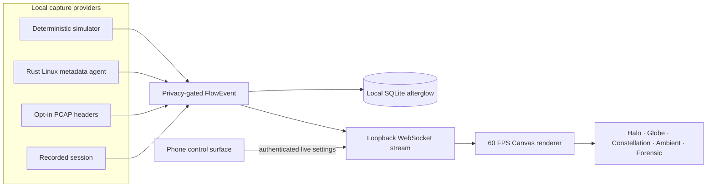

<div align="center">
  
  <h1>PacketHalo</h1>
  <p><strong>See where your home is speaking.</strong></p>
  <p>A local-first observatory that turns connection metadata into living light without inspecting packet contents.</p>
  <p>
    <a href="https://othmaneblial.github.io/PacketHalo/"><strong>Live project site</strong></a> ·
    <a href="#five-minute-start">Quick start</a> ·
    <a href="docs/simulator.md">Simulator</a> ·
    <a href="docs/privacy.md">Privacy</a> ·
    <a href="docs/architecture.md">Architecture</a> ·
    <a href="CONTRIBUTING.md">Contribute</a>
  </p>
  <p>
    <a href="https://github.com/OthmaneBlial/PacketHalo/actions/workflows/ci.yml"></a>
    <a href="https://github.com/OthmaneBlial/PacketHalo/releases/latest"></a>
    
    
    
    
  </p>
  <p><a href="https://othmaneblial.github.io/PacketHalo/"><strong>Explore the interactive showcase and field guide →</strong></a></p>
</div>


<div align="center">
  
</div>

> Packet contents are never inspected.

PacketHalo is an observatory for the network around you. Home sits at the center. Devices move in quiet orbit. Connections bloom into curved light, remote networks pulse at the edge, and the recent past fades instead of vanishing. It is designed to live on a wall before it is designed to answer a troubleshooting question.

No account. No telemetry. No analytics. No cloud dependency. The first run uses a deterministic simulator, so the complete visual experience works before any capture provider is enabled.

## Five-minute start

You need Node.js 22.5+ and pnpm 10.15+. The checked-in Node version is 22.23.2.

```bash
pnpm install
pnpm dev
```

Open:

- **Observatory:** http://127.0.0.1:5173
- **Phone control surface:** http://127.0.0.1:5174
- **Local event server:** http://127.0.0.1:8787/health

The Movie Night scene begins automatically. Press <kbd>Space</kbd> to pause, <kbd>M</kbd> to move through visual modes, <kbd>C</kbd> to clear the instruments, and <kbd>F</kbd> to project fullscreen.

Prefer containers?

```bash
docker compose up --build
```

Then open http://127.0.0.1:8080. The phone controller is at http://127.0.0.1:8081. All published Docker ports are host-loopback only.

## Five ways to see the same invisible world

| Mode              | Character                      | What emerges                                     |
| ----------------- | ------------------------------ | ------------------------------------------------ |
| **Halo**          | The signature living sculpture | Devices, luminous arcs, intensity and afterglow  |
| **Globe**         | A slowly turning world         | Geography, transfer weight and arc altitude      |
| **Constellation** | Services as stars              | Repetition, brightness and natural clusters      |
| **Ambient**       | Almost silent                  | Projector-safe movement with nearly no text      |
| **Forensic**      | An instrument, not a table     | Ports, ASNs, countries, protocols and confidence |

Nine coordinated palettes include OLED, projector and high-contrast themes. Every movement can be reduced; every primary control is keyboard reachable.

## The same instrument, from room to hand

| Forensic view                                                                        | Phone observatory                                                                                | Local controller                                                          |
| ------------------------------------------------------------------------------------ | ------------------------------------------------------------------------------------------------ | ------------------------------------------------------------------------- |
|  |  |  |

These captures come from the running production Docker stack. Addresses remain masked by the default privacy veil, and every visible flow is synthetic.

## A simulator worth leaving on

Twenty-four built-in scenes cover movie night, a dedicated Netflix premiere, calls, gaming, large downloads, developer workflows, IoT, public Wi-Fi and a suspiciously regular beacon. Each scene supports:

- pause and resume;
- ×0.25 slow motion, ×1, ×2, ×5 and ×20 time;
- recording, replay and scrubbing;
- explicit random seeds;
- repeatable metadata output.

The simulator is not sample decoration. It uses the same `FlowEvent` contract and renderer path as capture providers. Its IDs include the engine epoch, so deterministic restarts do not collide in persisted history. See [scenario semantics and replay](docs/simulator.md).

## Privacy is an architectural property

PacketHalo's event model contains connection metadata: endpoints, ports, transport, process when the operating system exposes it, byte and packet counts when a provider can measure them, geography, ASN, timestamps and an uncertainty-aware classification.

It has no field for—and the server rejects objects containing—payloads, request or response bodies, cookies, passwords, tokens, pages, email content, or chat messages. CI checks both TypeScript and Rust contracts on every change.

```text
permitted:  142.250.18.34 · QUIC/443 · AS15169 · 842 KB · browser · 92%
impossible: GET /private-page · Cookie: … · message text · response body
```

Read the [privacy promise](docs/privacy.md) and [security model](docs/security-model.md) before enabling a real provider. Runtime validation is exact-shape: undeclared fields are rejected instead of being silently persisted.

## Architecture at a glance



| Area                      | Purpose                                                                |
| ------------------------- | ---------------------------------------------------------------------- |
| `apps/web`                | React observatory and accessible instrument console                    |
| `apps/control`            | Responsive phone controller with live WebSocket settings               |
| `apps/server`             | Authenticated event stream, readiness, retention and provider registry |
| `apps/simulator`          | Headless scenario source for integration and Docker                    |
| `agent/rust-agent`        | Tokio-based Linux socket metadata provider                             |
| `packages/protocol`       | Payload-incapable cross-runtime event contract                         |
| `packages/simulator-core` | Seeded scenario engine, recording and playback                         |
| `packages/renderer`       | Canvas modes, palettes, interpolation and frame metrics                |
| `packages/geo`            | Offline-first location provider interface                              |

The deeper walkthrough explains [data flow, trust boundaries and package decisions](docs/architecture.md).

## Real Linux metadata

The first real provider reads `/proc/net/tcp*` and `/proc/net/udp*`. It observes the operating system's socket table, optionally resolves process names from `/proc/<pid>/fd`, and never opens a packet capture device.

```bash
cargo run --release --manifest-path agent/rust-agent/Cargo.toml
```

Unknown bytes, geography, ASN and organization remain zero or `Unknown`; PacketHalo does not invent precision. See [how capture works](docs/capture.md).

The provider API labels the simulator, recordings and Linux agent as available. PCAP and router adapters are explicitly reported as planned and are not presented as working integrations.

## Configuration and data lifecycle

The normal first run needs no environment file. Copy `.env.example` only when changing server behavior.

| Variable                       | Default                      | Purpose                                                         |
| ------------------------------ | ---------------------------- | --------------------------------------------------------------- |
| `PACKETHALO_HOST`              | `127.0.0.1`                  | Server bind host; non-loopback values require a strong token.   |
| `PACKETHALO_PORT`              | `8787`                       | Local HTTP and WebSocket port.                                  |
| `PACKETHALO_CONTROL_TOKEN`     | unset                        | 32–256 character bearer token for authenticated LAN mode.       |
| `PACKETHALO_DATABASE`          | `packethalo.db`              | Local SQLite metadata path.                                     |
| `PACKETHALO_RETENTION_MINUTES` | `60`                         | Stored history retention, from 1 minute to 7 days.              |
| `VITE_PACKET_HALO_SERVER`      | `ws://127.0.0.1:8787/stream` | Display stream; production containers use same-origin proxying. |

`pnpm reset:local` removes the three explicit local SQLite files after the server is stopped. The in-app **Clear browser data** action removes aliases, display preferences and the in-memory recording after confirmation. Docker history lives in the named `packethalo-data` volume; `docker compose down -v` intentionally deletes it.

## Production from source

Build the UIs, typed packages and standalone service bundles:

```bash
pnpm build
pnpm build:services
```

Run the production event server with `pnpm start:server`. In another terminal, run `pnpm preview:web` and open http://127.0.0.1:4173. `pnpm preview:control` serves the controller at http://127.0.0.1:4174. For the complete production topology, Docker Compose remains the recommended path.

## Verification

```bash
pnpm verify          # lint, types, unit tests, privacy, builds, Rust tests + Clippy
pnpm test:e2e        # desktop and phone interaction tests
pnpm bench           # deterministic 10,000-destination projection benchmark
pnpm measure:renderer # headed 1080p / 2,000-flow browser evidence
pnpm audit --audit-level=moderate
```

The test surface includes strict protocol privacy checks, seeded simulator repeatability and restart uniqueness, renderer layout tests, server authentication and cross-site WebSocket rejection, offline geo behavior, Rust `/proc` parsing, Playwright interactions and live renderer health readouts. CI runs TypeScript, Rust and real Docker startup jobs, then publishes the built observatory as a documentation preview artifact.

## Supported environments and honest limits

- Node.js 22.5+ is supported; 22.23.2 is pinned for contributors and containers.
- Rust 1.95.0 is pinned for the optional Linux agent.
- Automated browser behavior is validated in current desktop and mobile Chromium. Firefox and Safari remain manual compatibility checks.
- The real host agent supports Linux `/proc` only. macOS and Windows capture providers are not implemented.
- SQLite is local and unencrypted. PacketHalo is designed for a trusted single-user host, not Internet exposure or hostile multi-tenant hosting.
- PCAP metadata, router adapters and local MaxMind enrichment remain roadmap work.

See [compatibility](docs/compatibility.md), [troubleshooting](docs/troubleshooting.md), and the [release checklist](docs/release-checklist.md) for the exact operational gates.

## Raspberry Pi / projector appliance

The appliance profile boots Docker services automatically and launches Chromium fullscreen. Projection rotation is live, the phone controller works over authenticated LAN mode, and no keyboard is needed after setup.

Start with the [Raspberry Pi appliance guide](appliance/README.md).

## Documentation

- [Architecture](docs/architecture.md)
- [Simulator and recordings](docs/simulator.md)
- [Privacy promise](docs/privacy.md)
- [Security model](docs/security-model.md)
- [Capture providers](docs/capture.md)
- [Rendering system](docs/rendering.md)
- [Plugin system](docs/plugins.md)
- [Performance](docs/performance.md)
- [Troubleshooting](docs/troubleshooting.md)
- [Compatibility](docs/compatibility.md)
- [Changelog](CHANGELOG.md)
- [Release checklist](docs/release-checklist.md)
- [Roadmap](docs/roadmap.md)
- [FAQ](docs/faq.md)

## License

PacketHalo is open source under the [MIT License](LICENSE).

Contributions follow the [contribution guide](CONTRIBUTING.md), [code of conduct](CODE_OF_CONDUCT.md), and [security policy](SECURITY.md).
