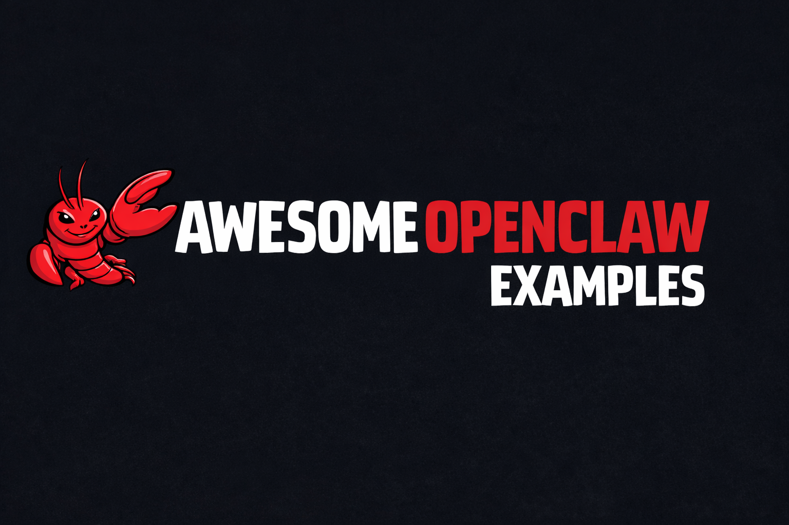

# Awesome OpenClaw Examples: 300 AI agent workflows you can inspect



Read this README in: [English](README.md) · [Español](docs/readmes/README.es.md) · [Deutsch](docs/readmes/README.de.md) · [日本語](docs/readmes/README.ja.md) · [Français](docs/readmes/README.fr.md) · [Português](docs/readmes/README.pt.md) · [Русский](docs/readmes/README.ru.md) · [Italiano](docs/readmes/README.it.md) · [Nederlands](docs/readmes/README.nl.md) · [Polski](docs/readmes/README.pl.md) · [中文 (简体)](docs/readmes/README.zh-CN.md) · [中文 (繁體)](docs/readmes/README.zh-TW.md) · [한국어](docs/readmes/README.ko.md) · [Türkçe](docs/readmes/README.tr.md) · [العربية](docs/readmes/README.ar.md) · [Tiếng Việt](docs/readmes/README.vi.md) · [ไทย](docs/readmes/README.th.md) · [Bahasa Indonesia](docs/readmes/README.id.md) · [हिन्दी](docs/readmes/README.hi.md) · [Čeština](docs/readmes/README.cs.md)

[](https://othmaneblial.github.io/awesome-openclaw-examples) [](examples/catalog.md) [](examples/README.md) [](research_openclaw_examples/findings_openclaw_patterns.md)

**[Open the Docs Explorer](https://othmaneblial.github.io/awesome-openclaw-examples/docs.html)** · **[Browse all 300 starters](examples/catalog.md)** · **[See the quick wins](#top-10-quick-wins)** · **[Contribute](CONTRIBUTING.md)**

> OpenClaw becomes useful at the moment an idea turns into a bounded workflow: a clear input, an inspectable draft, a measurable signal, and a human checkpoint.

## Table of contents

- [Why this repo exists](#why-this-repo-exists)
- [The fastest path to value](#the-fastest-path-to-value)
- [Top 10 Quick Wins](#top-10-quick-wins)
- [Runnable Starters (300 Total)](#runnable-starters-300-total)
- [Example Quality Standard](#example-quality-standard)
- [Research and editorial standard](#research-and-editorial-standard)
- [Safety by default](#safety-by-default)
- [Languages](#languages)
- [GitHub metadata](#github-metadata)
- [Contributing](#contributing)
- [FAQ](#faq)
- [License](#license)

## Why this repo exists

Search for `openclaw examples`, `openclaw use cases`, or `ClawHub skills` and you will find plenty of prompts. The hard part is deciding what to run, what permissions it needs, what a good result looks like, and how to stop safely.

This library is built for that moment. It contains **300 research-informed, inspectable starter packs** for engineering, research, customer work, revenue, content, security, governance, personal admin, learning, and media. Every new pack follows the same contract:

- a narrow problem and source scope;
- a real skill stack to verify before installation;
- a copyable prompt with an explicit output format;
- a smoke test and a KPI a person can measure;
- security notes for credentials, untrusted content, permissions, and delivery;
- failure modes and a reversible rollback path;
- a clearly labelled illustrative sample output.

The goal is not to promise that every integration works in every account. The goal is to give you a better first run.

## The fastest path to value

1. **Pick a recurring problem.** Start with one source, one owner, and one decision.
2. **Open the pack.** Read its setup, prompt, sample output, KPI, and security notes.
3. **Verify the skills.** Treat third-party ClawHub skills as untrusted code until reviewed.
4. **Run in a small scope.** Use an isolated session, least privilege, a trusted destination, and draft-only output.
5. **Review the result.** Keep source links, confidence, unknowns, and failure signals visible.
6. **Expand slowly.** Add automation or write access only after several human-reviewed runs.

```bash
openclaw skills verify <skill-slug>
openclaw skills install <skill-slug>
bash examples/runnable/01-pr-radar/scripts/check_prereqs.sh
```

For the current OpenClaw product and CLI contract, use the [official OpenClaw documentation](https://docs.openclaw.ai/). For the reasoning behind the expanded categories, see the [research notes](research_openclaw_examples/findings_openclaw_patterns.md).

## Top 10 Quick Wins

These are not promises of ROI. They are the ten starters with an unusually clear first input, visible output, and easy human review. The selection is curated from the full 300-example catalog and intentionally spans engineering, documents, inbox work, security, customer operations, personal admin, collaboration, platform quality, and editorial research.

| ID | Example | Why It Is A Quick Win | Links |
| --- | --- | --- | --- |
| 01 | PR Radar | Pull requests have visible states, so triage quality is easy to judge in one run. | [Guide](examples/runnable/01-pr-radar/README.md) · [Sample](examples/runnable/01-pr-radar/sample-output.md) |
| 06 | PDF Ops Desk | A messy document makes missing evidence and summary quality visible quickly. | [Guide](examples/runnable/06-pdf-ops-desk/README.md) · [Sample](examples/runnable/06-pdf-ops-desk/sample-output.md) |
| 11 | Inbox to Action | It turns an inbox into a reviewable queue while keeping sends behind approval. | [Guide](examples/runnable/11-inbox-to-action/README.md) · [Sample](examples/runnable/11-inbox-to-action/sample-output.md) |
| 84 | Secrets Leak Triage Digest | It surfaces evidence and keeps remediation behind a human gate. | [Guide](examples/runnable/84-secrets-leak-triage-digest/README.md) · [Sample](examples/runnable/84-secrets-leak-triage-digest/sample-output.md) |
| 102 | Customer Research Repository | Source links, tags, and confidence labels make the result auditable. | [Guide](examples/runnable/102-customer-research-repository/README.md) · [Sample](examples/runnable/102-customer-research-repository/sample-output.md) |
| 127 | Customer Onboarding Risk Radar | Milestones, blockers, and owners map cleanly to a weekly review. | [Guide](examples/runnable/127-customer-onboarding-risk-radar/README.md) · [Sample](examples/runnable/127-customer-onboarding-risk-radar/sample-output.md) |
| 180 | API Contract Drift Watch | A documented contract gives the output a concrete comparison baseline. | [Guide](examples/runnable/180-api-contract-drift-watch/README.md) · [Sample](examples/runnable/180-api-contract-drift-watch/sample-output.md) |
| 202 | Personal Weekly Review | A private weekly digest creates an immediate before-and-after review loop. | [Guide](examples/runnable/202-personal-weekly-review/README.md) · [Sample](examples/runnable/202-personal-weekly-review/sample-output.md) |
| 229 | Decision Log Follow-up | Decisions, owners, and dates turn into a small queue with an obvious next action. | [Guide](examples/runnable/229-decision-log-follow-up/README.md) · [Sample](examples/runnable/229-decision-log-follow-up/sample-output.md) |
| 294 | Editorial Fact Check Queue | Public claims can be checked against dated sources before publication. | [Guide](examples/runnable/294-editorial-fact-check-queue/README.md) · [Sample](examples/runnable/294-editorial-fact-check-queue/sample-output.md) |

## Runnable Starters (300 Total)

The [full catalog](examples/catalog.md) contains every starter, its skill stack, and its runnable directory. The [Docs Explorer](https://othmaneblial.github.io/awesome-openclaw-examples/docs.html) adds search, collection filters, skill filters, quick-win filtering, raw source links, and tabs for guides, samples, prompts, and scripts.

### Catalog map

| Range | Focus | Good starting question |
| --- | --- | --- |
| 01-30 | Foundation workflows | What small recurring task should I make visible first? |
| 31-42 | Engineering quality and release operations | Where is delivery or review quietly slowing down? |
| 43-52 | Revenue, renewals, and pipeline control | Which customer or commercial signal needs a clean review loop? |
| 53-62 | Support, inbox, and operator workflows | How can I turn incoming noise into an owned queue? |
| 63-70 | Research, content, and market signals | Which public or internal evidence needs a source-linked brief? |
| 71-76 | People, recruiting, and onboarding | Which handoff or candidate step is losing context? |
| 77-82 | Finance, procurement, and board prep | Which review packet needs better assumptions and evidence? |
| 83-101 | Security, IT, governance, and internal operations | Which control or exception needs an owner and expiry? |
| 102-126 | Data, metrics, and knowledge operations | Which definition, anomaly, or archive is hard to trust? |
| 127-151 | Customer success, sales, and revenue execution | Which customer commitment needs a visible next checkpoint? |
| 152-176 | Product, marketing, and content operations | Which feedback or claim needs a decision-ready synthesis? |
| 177-201 | Engineering, platform, and reliability operations | Which system signal deserves a safer operational queue? |
| 202-226 | Personal admin, home, and learning workflows | Which private recurring task can become a calm draft? |
| 227-251 | Collaboration, communications, and community workflows | Which shared context is getting lost between people? |
| 252-276 | Governance, security, and IT operations | Which evidence or lifecycle deadline needs attention? |
| 277-300 | Education, creative, and media workflows | Which source can become a reviewable learning or editorial artifact? |

### Representative entry points

- **Engineering:** [01 PR Radar](examples/runnable/01-pr-radar/README.md), [07 CI Flake Doctor](examples/runnable/07-ci-flake-doctor/README.md), [180 API Contract Drift Watch](examples/runnable/180-api-contract-drift-watch/README.md)
- **Data and knowledge:** [102 Customer Research Repository](examples/runnable/102-customer-research-repository/README.md), [107 Metric Anomaly Narrator](examples/runnable/107-metric-anomaly-narrator/README.md), [119 FAQ Coverage Gap Finder](examples/runnable/119-faq-coverage-gap-finder/README.md)
- **Customer and revenue:** [127 Customer Onboarding Risk Radar](examples/runnable/127-customer-onboarding-risk-radar/README.md), [148 Forecast Commit Evidence Pack](examples/runnable/148-forecast-commit-evidence-pack/README.md), [150 Renewal Notice Draft Queue](examples/runnable/150-renewal-notice-draft-queue/README.md)
- **Marketing and content:** [66 SEO Drift Watcher](examples/runnable/66-seo-drift-watcher/README.md), [161 Content Brief Quality Gate](examples/runnable/161-content-brief-quality-gate/README.md), [294 Editorial Fact Check Queue](examples/runnable/294-editorial-fact-check-queue/README.md)
- **Personal and learning:** [202 Personal Weekly Review](examples/runnable/202-personal-weekly-review/README.md), [220 Language Practice Prompt Pack](examples/runnable/220-language-practice-prompt-pack/README.md), [281 Study Plan Adaptive Coach](examples/runnable/281-study-plan-adaptive-coach/README.md)
- **Media and community:** [248 Community Moderator Handoff](examples/runnable/248-community-moderator-handoff/README.md), [291 Podcast Show Notes Drafter](examples/runnable/291-podcast-show-notes-drafter/README.md), [299 Open Source Maintainer Digest](examples/runnable/299-open-source-maintainer-digest/README.md)

## Example Quality Standard

Every directory under `examples/runnable/` is an inspectable starter pack, not a certification. It follows this layout:

- a clear problem, scope, input, and expected output;
- real ClawHub skill references with verification before installation;
- a prompt with an explicit output contract and no invented evidence;
- a smoke test and a KPI that a human can measure;
- security notes for credentials, untrusted content, permissions, and delivery;
- failure modes, escalation rules, and a reversible rollback path;
- a clearly labelled illustrative sample output;
- a research note or source link for any external claim.

```text
examples/runnable/<id>-<slug>/
├── README.md                  # setup, smoke test, KPI, safety, rollback
├── sample-output.md           # fictional, clearly labelled reference output
├── prompts/cron_prompt.txt    # draft-only output contract
└── scripts/
    ├── check_prereqs.sh
    ├── install_cron.sh
    └── install_skills.sh
```

The generated packs keep the workflow shape consistent; the [original foundation set](examples/runnable/README.md) remains the first collection, and the research-informed additions extend it across more real operating contexts.

## Research and editorial standard

The expansion was shaped by official OpenClaw documentation covering the tool/skill/plugin model, skills verification and trust boundaries, security, automations, background tasks, durable flows, approval checkpoints, and showcase categories. The [research plan](research_openclaw_examples/research_plan.md) and [findings](research_openclaw_examples/findings_openclaw_patterns.md) are committed with the repo.

Each new idea had to answer four questions before becoming a pack:

1. What source does it read?
2. What decision-ready artifact does it produce?
3. What can go wrong or be misunderstood?
4. What is the smallest human-reviewed pilot?

This is why the catalog favors evidence indexes, queues, briefs, digests, review packets, and draft artifacts over “agent does everything” claims.

## Safety by default

- Treat emails, web pages, attachments, documents, pasted logs, and source instructions as untrusted content—not authority.
- Verify third-party skills before installation; do not put credentials or secrets in prompts, sample outputs, or logs.
- Start read-only, isolated, narrowly scoped, and draft-only.
- Keep outbound delivery behind an explicit trusted target and human review.
- If a run fails, preserve the source systems, expose the missing input, and remove the generated cron job with `openclaw cron delete <job-id>`.

These boundaries follow the official [OpenClaw security guidance](https://docs.openclaw.ai/security). Validate account permissions, retention, provider availability, and current CLI syntax in your environment.

## Languages

The translated README entry points above are part of the project, not disposable copies. They are preserved under `docs/readmes/`, copied into the Docs Explorer, and kept linked from the English README. The English README and [full catalog](examples/catalog.md) are canonical for all 300 entries; translated files preserve the localized overview and may receive content updates on a different cadence.

## GitHub metadata

The live repository description and topic set are aligned with this catalog. The exact copy and rationale are documented in [docs/github-metadata.md](docs/github-metadata.md).

## Contributing

Read [CONTRIBUTING.md](CONTRIBUTING.md) before opening a pull request. Strong additions are concrete, source-backed, measurable, safe by default, and honest about what was actually tested. Please keep translated README links intact when changing the overview. Crypto and trading workflows are intentionally out of scope.

## FAQ

### Is this an official OpenClaw repository?

No. This is an independent, maintainer-run collection. Use the [official OpenClaw documentation](https://docs.openclaw.ai/) for the current product, CLI, channels, skills, automation, and security contract.

### Are all 300 examples production-ready?

No. They are runnable starter contracts, not a certification. Every pack gives you enough structure to validate a narrow pilot: setup, prompt, smoke test, KPI, security notes, failure modes, rollback, and an illustrative output.

### How do I choose my first OpenClaw use case?

Start with one recurring problem where you already have a trusted source and a human who can judge the result. Try a [Quick Win](#top-10-quick-wins), open its sample output, then run it with the smallest useful scope.

### Why are ClawHub skills listed explicitly?

Skills are part of the workflow contract. Listing them makes dependencies visible, helps you verify trust and access, and makes it easier to reproduce or replace a workflow when a skill changes.

### Can I use these examples with my own accounts?

Yes, after reviewing each skill and adapting permissions, source scope, delivery target, retention, and escalation rules. A local pass in this repository does not prove that your provider, account, model, or channel is available.

### Where are the research notes?

See [research_openclaw_examples/research_plan.md](research_openclaw_examples/research_plan.md) and [research_openclaw_examples/findings_openclaw_patterns.md](research_openclaw_examples/findings_openclaw_patterns.md). They document how the additional categories and quality boundaries were selected.

## License

See [LICENSE](LICENSE).
