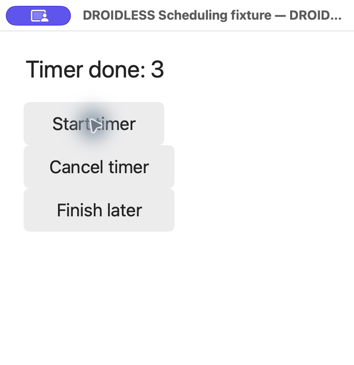

# Main-thread scheduling and bounded guest workers

Current source owns a bounded main-thread message queue. Handler callbacks execute
the APK's DEX in the same interpreter as lifecycle and input callbacks. Posting
does not run the callback inline. Current source also executes deferred guest
workers with shared objects, independent managed frames and stable Thread identity.
LinkedBlockingQueue take/put can suspend those workers until data/capacity or an
interrupt becomes available. This remains a bounded subset, not full Java concurrency.

## Supported surface

| Family | Exact subset |
|---|---|
| Looper | getMainLooper, myLooper, getThread; prepare creates one metadata-only worker Looper; main quit/quitSafely throw IllegalStateException |
| Handler construction | (), (Looper), (Callback), (Looper, Callback); main Looper only |
| Runnable posts | post(Runnable), postDelayed(Runnable, long), postAtTime(Runnable, long), postAtTime(Runnable, Object, long) |
| Message delivery | obtainMessage(), obtainMessage(int), sendMessage(Message), sendMessageDelayed(Message, long), sendMessageAtTime(Message, long), dispatchMessage(Message), handleMessage(Message) |
| Cancellation | hasCallbacks(Runnable), removeCallbacks(Runnable), removeCallbacks(Runnable, Object), removeCallbacksAndMessages(Object) |
| Message | constructor(), obtain(), getTarget, setTarget, getCallback, getWhen; public what/arg1/arg2/obj fields |
| Clock | SystemClock.uptimeMillis and elapsedRealtime return process-relative monotonic milliseconds |
| Thread | currentThread; constructors (String) and (Runnable, String); getName/setName/getId/isAlive; start once, interrupt/isInterrupted/interrupted, holdsLock; explicit run() calls the stored Runnable |
| Worker queue waits | LinkedBlockingQueue take()/put(Object); immediate results on main, suspend/resume on a worker |
| Monitors | DEX monitor-enter/exit, reentrant ownership, contention and IllegalMonitorStateException |
| Collection | System.gc invokes the runtime's managed collector |

Handler dispatch honors APK overrides. Default dispatch runs a posted Runnable
first; otherwise it calls Handler.Callback and, unless handled, the virtual
handleMessage override. Callbacks may enqueue later callbacks. Cancellation is
scoped to the receiving Handler and matches callbacks/tokens by object identity;
a null cancellation token matches all tokens. Pending and active Messages are
GC roots, retaining their Handler, callback and payload graph.

Messages run in deadline order, then FIFO insertion order for equal deadlines.
Negative delays become zero; past absolute deadlines are due at the next poll.
Each Message is one-shot: queued or consumed Messages cannot be sent again.
Dispatch/cancellation clears payloads and marks the Message consumed. Public
pooling/recycle and other obtain overloads are unsupported.

## Host clocks and shutdown

Headless execution starts at zero and advances only through `--advance-ms` or
Runtime.advance_time. Immediate posts drain after launch and each replay action.
Native AppKit execution uses Rust Instant and polls at event-loop boundaries,
with an idle wait of up to 50 ms. It redraws after callbacks mutate guest Views.
This does not model Android device boot time, deep sleep or precise timer latency.
Switching to the native clock disables manual advancement.

There are at most 16,384 pending Messages and 1,024 callbacks per poll, sharing
the existing five-million-instruction budget. Clock/deadline arithmetic is
checked. Limits report terminal diagnostics and preserve remaining queued work.
Uncaught callback exceptions propagate with their original guest cause and clean
interpreter frames. Root Activity finish or host close cancels pending work;
subsequent posts return false. Finishing a child Activity retains the app queue.

## Worker execution and limits

Thread.start enqueues execution and returns; it does not call run inline. APK
Thread.run overrides and stored Runnable targets execute their DEX on a named Rust
host worker executor. At event-loop polls the runtime transfers its exclusive
borrow onto that executor, then joins it before main Handler/UI processing.
Guest workers retain distinct Thread identities and frame stacks across polls;
they can migrate between host executor threads. One shared heap is used throughout.
**Guest execution is serial, not parallel CPU execution.** This conservative
scheduler gives sequentially consistent shared memory, with no isolated heap copies.

A poll allows 64 worker slices of 1,024 top-level DEX steps each, shared across
its message dispatches, and at most 64 live workers. Native bridges and class
initialization remain synchronous within a step and share the existing overall
instruction budget. This is not precise wall-time preemption. Blocking workers
execute no more instructions until the queue/monitor is ready. Queue waits retain
the invoke PC and every caller/callee register/result/exception; values and locks
remain GC roots. No empty take or full put is converted into fabricated success.

Monitor ownership is reentrant and belongs to the guest Thread, not the host
executor. Contending workers retain their monitor-enter PC. Interrupt wakes a
queue wait with InterruptedException and clears the interrupt flag; monitor
acquisition remains non-interruptible. Restarting an already started/terminated
Thread throws IllegalThreadStateException. Terminal worker faults remain visible
host diagnostics, mark that worker dead and release its locks. Custom uncaught
exception handlers are not implemented.

Worker View/Activity calls are explicitly rejected before mutation; results must
be posted to a main Handler. Looper.myLooper is null on an unprepared worker;
prepare creates one worker Looper associated with that Thread, and a second prepare
throws RuntimeException. Worker loop()/Handler delivery, priority, sleep/join,
wait/notify, timed queue waits, executors and java.util.Timer remain unsupported.
Handler construction on a worker must explicitly select the main Looper.

Blocking on main, or suspension across a synchronous native bridge/initializer,
remains an explicit terminal diagnostic. Immediate take/put work on main. A future
main continuation/native bridge expansion must preserve these waits, not turn
blocking into inline execution. Host close/root finish cancels worker continuations
and releases their roots/locks without claiming guest finally execution at process
shutdown. Main callbacks and widgets retain their host main-thread requirement.

## Evidence and reproduction

DEX-to-DEX calls now use a managed continuation stack. The internal evaluator
can pause/resume at instruction boundaries; tests collect between each step and
retain nested call arguments, reference/wide results and caught exceptions.
Native bridges and class initialization remain synchronous within a step.
The worker scheduler now uses this continuation stack for queue/monitor waits.
[Frame semantics and limits](dex-vm.md#frame-and-value-semantics).

The authored [Scheduling fixture](../examples/scheduling/MainActivity.java)
checks deferred execution, equal-time ordering, callback overrides, cancellation
identity, Message fields, main-thread identity, clock boundaries and GC retention.
Rust regressions additionally cover queue capacity, self-posting limits, callback
errors and shutdown. Its separate ThreadContract also passes on desktop Java 17
with Java 8 source/target; it covers metadata/manual run. WorkerContract separately
passes desktop Java and compiled DEX for identity, queue waits, interruption,
reentrant locks and contention. Headless tests verify worker-to-main UI posting,
GC across waits, rejected direct UI access, native-bridge suspension guards, faults,
capacity, bounded spinning and shutdown. No Android reference differential run,
fresh native worker interaction or independent asynchronous workflow is claimed.

```sh
cargo build --release --locked
target/release/droidless run --headless --ephemeral fixtures/generated/scheduling.apk \
  --click "Start timer" --advance-ms 1500 --advance-ms 1500 --advance-ms 1500
# JSON View text: Timer done: 3
target/release/droidless run --ephemeral --size 360x340 fixtures/generated/scheduling.apk
```

Actual native clicks produced Waiting for timer, then Timer done: 3 after three
delayed callbacks. Starting and cancelling before the first deadline left Timer
cancelled after that deadline. Finish later executed its delayed finish and
emitted onPause/onStop/onDestroy, exiting with status 0.



The earlier scheduling and immediate-queue checkpoints diagnosed Notepad's
LinkedBlockingQueue constructor and then Thread.start. Current source resolves
both: the unchanged release now advances through deferred Thread.start and stops
at Integer.TYPE in DBFlow's generated Notepad adapter `d/n.<init>` at PC `0x0007`,
under DBFlow config `a.<init>` PC `0x005c` and Application.onCreate PC `0x0016`.
This is still before Activity/UI creation; the independent worker/notes workflow
has not executed successfully. The 50% checkpoint remains ahead. The v0.1.0 release
archive predates scheduling and workers.

API references: [Android Handler](https://developer.android.com/reference/android/os/Handler),
[Message](https://developer.android.com/reference/android/os/Message),
[Looper](https://developer.android.com/reference/android/os/Looper),
[Java Thread](https://docs.oracle.com/javase/8/docs/api/java/lang/Thread.html),
[LinkedBlockingQueue](https://docs.oracle.com/javase/8/docs/api/java/util/concurrent/LinkedBlockingQueue.html),
[Java synchronization](https://docs.oracle.com/javase/specs/jls/se8/html/jls-17.html#jls-17.1).

```sh
cargo test -p droidless-runtime --test workers --locked
mkdir -p artifacts/worker-java-contract
javac -source 8 -target 8 -Xlint:-options -d artifacts/worker-java-contract examples/scheduling/WorkerContract.java
java -cp artifacts/worker-java-contract org.droidless.scheduling.WorkerContract
target/release/droidless run --headless --ephemeral fixtures/generated/scheduling.apk --click "Start worker"
# JSON View text: Worker result: kept-consumer:payload
```
