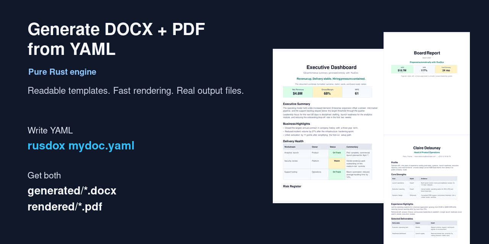
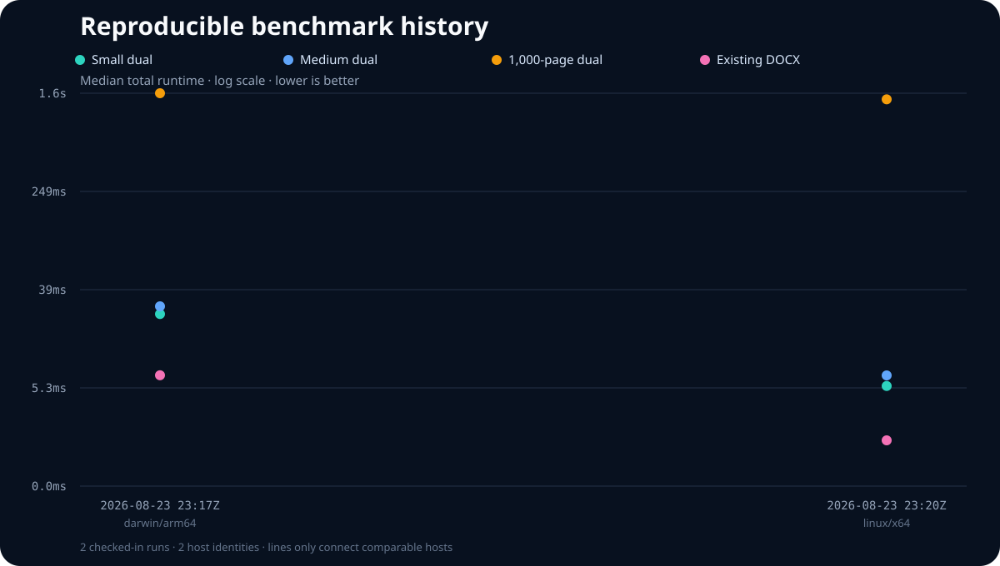
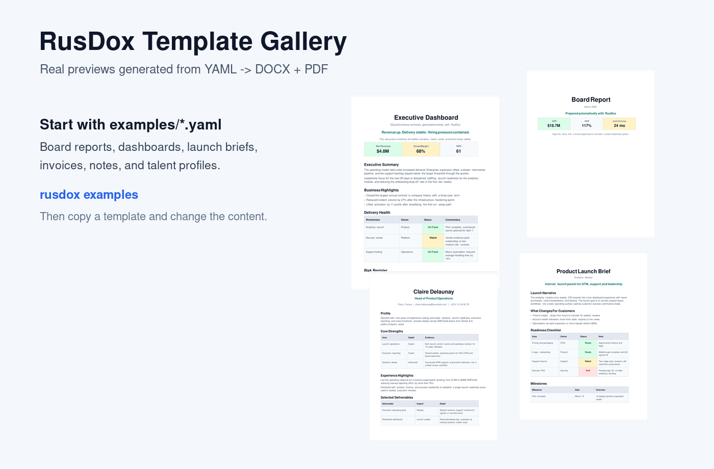

# RusDox


**One readable spec → editable DOCX + native PDF, at Rust speed, without Word or LibreOffice.**

[Website](https://othmaneblial.github.io/rusdox/) · [Playground](https://othmaneblial.github.io/rusdox/playground/) · [Template registry](https://othmaneblial.github.io/rusdox/registry/preview.html) · [Documentation](https://othmaneblial.github.io/rusdox/docs.html) · [Gallery](https://othmaneblial.github.io/rusdox/#examples) · [Releases](https://github.com/OthmaneBlial/rusdox/releases) · [crates.io](https://crates.io/crates/rusdox) · [Roadmap](ROADMAP.md) · [Discussions](https://github.com/OthmaneBlial/rusdox/discussions)



## See the full workflow in 24 seconds



The final frame keeps the YAML input beside both outputs. Inspect the real files: [YAML source](examples/product_launch_brief.yaml), [editable DOCX](site/generated/product-launch-brief.docx), and [native PDF](site/rendered/product-launch-brief.pdf).

RusDox is not just another YAML-to-document helper. It is a pure Rust document engine built for generating `.docx` and `.pdf` files programmatically, fast enough for serious automation.

If you have ever tried to create Word or PDF files in code, you already know the usual failure modes:

- slow office runtimes
- brittle conversions
- poor control over layout
- painful scaling when documents get large

RusDox keeps authoring simple with YAML and keeps the rendering path in Rust. Performance evidence now comes from a versioned small/medium/1,000-page protocol that records the exact host, toolchain, inputs, output sizes, timings, and peak memory. See [Benchmark proof](#benchmark-proof) before comparing it with another system.

## Bring your own Word design

Keep the layout your team already designed in Word, add readable placeholders, then drive it from JSON:

    rusdox template inspect proposal.docx
    rusdox template verify proposal.docx data.json --strict

One command writes an editable DOCX, native PDF, deterministic page snapshots, and HTML/JSON parity evidence. Syntax v1 supports nested values, loops over complete paragraphs or table rows, conditions, filters, and reusable partials while preserving untouched package parts byte-for-byte. Start with the bundled [invoice](templates/invoice/), [proposal](templates/proposal/), or [board report](templates/board-report/), then read the [Word-native template guide](docs/word-templates.md).

Discover those templates through the signed, curated registry without cloning
the repository:

    rusdox template list
    rusdox template search compliance
    rusdox template add board-report
    rusdox template update --all

The CLI verifies the Ed25519-signed manifest and every downloaded SHA-256 before
an atomic install. Each entry exposes its license, contributor, documented
inputs, preview, supported RusDox versions, accessibility notes, and verified
DOCX/PDF parity evidence. Browse the [public registry](https://othmaneblial.github.io/rusdox/registry/preview.html)
or read its [trust and contribution contract](docs/template-registry.md).

## Put document parity in every pull request

Use the repository as a reusable GitHub Action to annotate validation errors on
their exact source lines, render DOCX/PDF output, and retain parity evidence in
the calling repository's Actions run:

```yaml
- uses: actions/checkout@v5
- uses: OthmaneBlial/rusdox@main
  with:
    input: documents
    github-token: ${{ secrets.GITHUB_TOKEN }}
```

The optional PR comment contains check metadata, not document contents. Raw
DOCX/PDF files stay on the ephemeral runner and report upload can be disabled
for confidential workloads. Read the [GitHub Action contract](docs/github-action.md)
and copy the [workflow recipes](examples/github-actions/).

For application integrations, use the object-safe Rust `Renderer` boundary or
the same versioned JSON request over `rusdox serve stdio`. Official executable
examples cover [Node, Python, Go, and CI](examples/integrations/) without four
premature SDKs. A tiny opt-in HTTP adapter binds loopback only and reuses the
identical request contract; see the [integration protocol](docs/integrations.md).

## Make a first contribution without learning OOXML

Ten maintained starter tasks each have one checked-in fixture, a narrow scope,
and three acceptance criteria. Prepare an isolated work area with:

```bash
node scripts/contributor_lab.mjs list
node scripts/contributor_lab.mjs prepare protocol-inline-toml
```

Start from the [`good first issue` queue](https://github.com/OthmaneBlial/rusdox/issues?q=is%3Aissue+is%3Aopen+label%3A%22good+first+issue%22),
read the [architecture map](docs/architecture.md) and [contribution guide](CONTRIBUTING.md),
then use the contributor lab for parity and visual diffs. Merged work is credited
in [CONTRIBUTORS.md](CONTRIBUTORS.md) and the relevant release notes. Real,
non-confidential examples and viewer priorities belong in [Discussions](https://github.com/OthmaneBlial/rusdox/discussions).

## Schema-first authoring

Every current spec declares version 1. Generate the same JSON Schema used by
the bundled VS Code tooling, or migrate a legacy file atomically:

    rusdox schema --output rusdox-spec-v1.schema.json
    rusdox migrate legacy.yaml --in-place
    rusdox validate current.yaml --format json

YAML, JSON, and TOML share nested paths, bounded when branches, five
deterministic filters, literal-brace escaping, and source-located validation.
There is deliberately no general-purpose expression runtime. Read the
[spec-versioning policy](docs/spec-versioning.md) or use the zero-dependency
[VS Code extension](editors/vscode/README.md).

For production upgrades, read the [v1 stability contract](docs/stability.md): it
defines SemVer behavior for the Rust API, CLI, spec, Word-template syntax, and
rendered outputs; Rust 1.88.0 is the tested MSRV. The public library now denies
missing rustdoc and broken documentation links, and tagged releases run an
independent API compatibility scan before publication.

For the local feedback loop, run `rusdox dev mydoc.yaml --open`. The loop keeps
the last successful PDF visible while reporting the current validation issue,
timings, output paths, and whether an input, config, include, or asset triggered
the rebuild. Use `--json` for JSON Lines automation or `--quiet --port 0
--max-builds 1` for a bounded CI smoke check.

## Try it without installing

The [local-first playground](https://othmaneblial.github.io/rusdox/playground/?example=product-launch-brief)
loads verified examples, lets you edit YAML, previews the document structure, and
downloads your edited spec. It has no upload endpoint, analytics, or persistence.
The browser preview is deliberately not presented as PDF layout: verified DOCX/PDF
downloads stay available only while the checked-in source is unchanged, and edited
files are reproduced with the exact CLI command shown beside the preview. Read the
[WASM feasibility decision](docs/wasm-feasibility.md) for the full boundary.

## Install in 10 seconds

macOS or Linux:

```bash
curl -fsSL https://raw.githubusercontent.com/OthmaneBlial/rusdox/main/scripts/install.sh | sh
```

Windows PowerShell:

```powershell
irm https://raw.githubusercontent.com/OthmaneBlial/rusdox/main/scripts/install.ps1 | iex
```

Rust users can also install from crates.io:

```bash
cargo install rusdox --locked
# or, when cargo-binstall is available
cargo binstall rusdox
```

Release installers verify the archive against the published `SHA256SUMS` file before installing it.

Create and render the first document:

```bash
mkdir my-rusdox-docs && cd my-rusdox-docs
rusdox init-doc mydoc.yaml
rusdox mydoc.yaml
```

Outputs:

- `generated/mydoc.docx` — editable Word document
- `rendered/mydoc.pdf` — native PDF preview

See [Getting started](docs/getting-started.md) for the complete two-minute walkthrough.

## Why It Lands

- Exercise a checked-in 1,000-page DOCX/PDF stress tier with independently reproducible evidence.
- Create large files without Word, LibreOffice, or an external office runtime.
- Keep authoring readable with YAML while the heavy lifting stays in Rust.
- Validate specs before render so semantic issues fail early in CI and local workflows.
- Rebuild documents automatically while editing specs or config files.
- Benchmark real parse, validation, compose, DOCX, and PDF timings from the CLI.
- Turn designer-authored Word files into strict JSON-driven DOCX/PDF/parity bundles.
- Keep simple authoring in YAML longer with variables, includes, and repeaters.
- Set document metadata such as title, author, subject, keywords, and custom properties directly from specs or Rust.
- Use one tool for recurring reports, invoices, proposals, dashboards, and batch document jobs.

## Real-World Use Cases

- Executive and board reporting: recurring operating packs, KPI dashboards, and leadership reviews
- Client-facing automation: proposals, invoices, onboarding packs, and launch briefs
- Internal document infrastructure: batch exports, meeting notes, project briefs, and template-driven pipelines

## Why RusDox instead of another pipeline?

| Capability | RusDox | Office conversion pipeline | DOCX-only library | PDF typesetter |
|---|:---:|:---:|:---:|:---:|
| Editable DOCX output | Yes | Yes | Yes | Usually no |
| Native PDF output | Yes | No | No | Yes |
| Word/LibreOffice runtime required | No | Yes | No | No |
| Human-readable document spec | Yes | Varies | Code-first | Varies |
| Same typed model for both outputs | Yes | No | No | No |
| Automated DOCX/PDF parity report | Yes | No | No | No |

RusDox does not claim complete OOXML coverage. Check the [compatibility matrix](docs/compatibility.md) for supported, partial, and intentionally unsupported behavior.

## Benchmark Proof



The benchmark lab runs small (1 page), medium (4 rendered pages), and 1,000-page fixtures through validation-only, DOCX-only, PDF-only, and dual-output pipelines. Existing-DOCX open/save is measured separately. Each raw JSON report records CPU, OS, architecture, Rust version, input SHA-256, exact flags, output sizes, median timings, and peak resident memory.

Reproduce the full release-mode protocol:

```bash
cargo build --release --locked --bin rusdox
node scripts/run_benchmark_protocol.mjs --output target/benchmarks/local.json
```

Read the [methodology, regression thresholds, and limitations](docs/performance.md), inspect the derived [history data](benchmarks/history.json), or open the unrounded [raw reports](benchmarks/results/). Results from different machines are not presented as directly comparable scores.

## First document

Create a starter doc:

```bash
mkdir my-rusdox-docs
cd my-rusdox-docs
rusdox init-doc mydoc.yaml
```

Edit `mydoc.yaml`:

```yaml
version: 1
output_name: client-brief
blocks:
  - type: title
    text: Client Brief
  - type: subtitle
    text: Q2 rollout
  - type: section
    text: Summary
  - type: body
    text: Launch is approved pending final security FAQ wording.
  - type: bullets
    items:
      - Pricing is approved.
      - Support macros are in review.
      - Commercial release is planned for April 7.
```

Generate the files:

```bash
rusdox mydoc.yaml
```

You get:

- `generated/client-brief.docx`
- `rendered/client-brief.pdf`

Render a whole folder of YAML docs:

```bash
rusdox examples
```

Validate before rendering:

```bash
rusdox validate mydoc.yaml
rusdox validate examples --format json
```

Watch a spec while editing:

```bash
rusdox watch mydoc.yaml
```

Benchmark a render path:

```bash
rusdox bench examples/stress/stress_1000_pages.yaml --iterations 5 --warmup 1
```

## What Makes It Different

- Pure Rust `.docx` generation
- Pure Rust PDF rendering
- No Word dependency
- No LibreOffice dependency
- Human-readable YAML examples
- Config-driven styling through `rusdox.toml`
- Reusable named paragraph, run, and table styles with inheritance
- YAML composition features for variables, includes, and repeaters
- First-class document metadata in specs and the Rust API
- First-class `validate`, `dev`, `watch`, and `bench` CLI workflows

## Examples

`examples/` is now a folder of YAML document specs.

Highlights:

- `examples/board_report.yaml`
- `examples/executive_dashboard.yaml`
- `examples/product_launch_brief.yaml`
- `examples/talent_profile.yaml`
- `examples/formatting_showcase.yaml`
- `examples/named_styles_showcase.yaml`
- `examples/visual_assets_showcase.yaml`
- `examples/yaml_composition_showcase.yaml`
- `examples/stress/stress_1000_pages.yaml`

More detail is in [examples/README.md](examples/README.md).

## Template Gallery



Browse the gallery:

- [Open Board Report in the playground](https://othmaneblial.github.io/rusdox/playground/?example=board-report)
- [Open Executive Dashboard in the playground](https://othmaneblial.github.io/rusdox/playground/?example=executive-dashboard)
- [Open Product Launch Brief in the playground](https://othmaneblial.github.io/rusdox/playground/?example=product-launch-brief)
- [Open Talent Profile in the playground](https://othmaneblial.github.io/rusdox/playground/?example=talent-profile)
- [Open Invoice in the playground](https://othmaneblial.github.io/rusdox/playground/?example=invoice)
- [Open Meeting Notes in the playground](https://othmaneblial.github.io/rusdox/playground/?example=meeting-notes)
- [docs/gallery.md](docs/gallery.md)
- [examples/board_report.yaml](examples/board_report.yaml)
- [examples/executive_dashboard.yaml](examples/executive_dashboard.yaml)
- [examples/product_launch_brief.yaml](examples/product_launch_brief.yaml)
- [examples/talent_profile.yaml](examples/talent_profile.yaml)

## Docs

The full documentation lives in [`docs/`](docs/README.md).

Start here:

- [docs/README.md](docs/README.md)
- [docs/getting-started.md](docs/getting-started.md)
- [docs/yaml-guide.md](docs/yaml-guide.md)
- [docs/configuration.md](docs/configuration.md)
- [docs/cli.md](docs/cli.md)
- [docs/gallery.md](docs/gallery.md)
- [docs/rust-api.md](docs/rust-api.md)
- [docs/compatibility.md](docs/compatibility.md)
- [docs/troubleshooting.md](docs/troubleshooting.md)

## Configuration

The easiest way to tweak styling is the CLI wizard, not manual TOML editing:

```bash
rusdox config path
rusdox config wizard --level basic
rusdox config wizard --level advanced
```

The install script creates a user config at `~/rusdox/config.toml` when it does not exist yet.

Use it to control:

- fonts
- spacing
- colors
- table defaults
- output folders
- PDF preview behavior

If you want settings only for one project, create a local override:

```bash
rusdox config wizard --path ./rusdox.toml --level basic
```

Load order is:

- `./rusdox.toml`
- `~/rusdox/config.toml`
- built-in defaults

The goal is simple:

- content lives in YAML
- styling lives in config
- speed lives in Rust

## Advanced

If you need full control, dynamic generation, or lower-level document work, RusDox still exposes the Rust API.

See [docs/rust-api.md](docs/rust-api.md). The full docs index is in [docs/README.md](docs/README.md).

That doc covers:

- `cargo add rusdox`
- direct Rust document construction
- config-driven `Studio` usage
- legacy `.rs` script execution
- low-level API notes

## Community

If you want to contribute or report something:

- [CONTRIBUTING.md](CONTRIBUTING.md)
- [CODE_OF_CONDUCT.md](CODE_OF_CONDUCT.md)
- [SECURITY.md](SECURITY.md)
- [SUPPORT.md](SUPPORT.md)
- [GitHub Discussions](https://github.com/OthmaneBlial/rusdox/discussions)
- [ROADMAP.md](ROADMAP.md)

## Status

The current foundation focuses on fast, typed support for:

- paragraphs
- runs and common text formatting
- tables, rows, and cells
- named paragraph, run, and table styles with inheritance
- image, logo, signature, and SVG/chart blocks
- plain-text extraction
- config-driven composition
- YAML/JSON/TOML document specs

Current limitations are documented rather than hidden. High-level specs now expose shared page controls, visible headers/footers, page fields, links, bookmarks, TOC fields, footnotes, merged/rich cells, row pagination controls, and bounded nested tables. Comments, tracked changes, arbitrary per-section geometry, complex bidirectional shaping, and Word-native placeholder templates remain outside the current contract. Follow the [compatibility matrix](docs/compatibility.md) and [roadmap](ROADMAP.md) for exact boundaries and parity evidence.

## Development

```bash
cargo fmt
cargo clippy --all-targets --all-features -- -D warnings
cargo test
```
