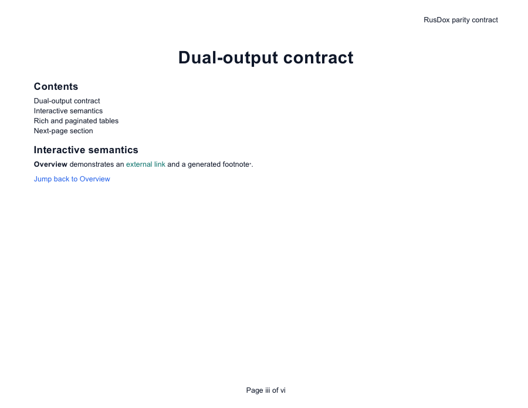

# Dated Viewer Compatibility Scorecard

- Evidence date: **2026-08-24**
- Host: **macOS 26.6 (25G72), Apple Silicon**
- Fixture: [`dual_output_contract.yaml`](../examples/dual_output_contract.yaml)

This scorecard reports what was actually exercised. “Open smoke passed” means the application held the exact checked-in fixture open. It is intentionally weaker than a visual-fidelity pass.

## Results

| Viewer | Version | Artifact | Result | Proven scope |
|---|---|---|---|---|
| RusDox OOXML validator | `0.1.1+unreleased` | DOCX | Passed | XML is well formed; required content types and internal relationship targets resolve; reopen→modify→save passes. |
| Apple Pages | 13.1 (`7037.0.101`) | DOCX | Open smoke passed | Pages held the exact DOCX fixture open. No pixel-level fidelity claim is made. |
| Apple Preview + Quick Look | Preview 11.0 / macOS 26.6 | PDF | Open + first-page raster passed | Preview held the exact PDF open; Quick Look produced the inspected first-page PNG below. |
| Microsoft Word for Mac | 16.112 (`16.112.26081010`) | DOCX | Blocked on evidence host | The installed app returned AppleScript error `-1708` and never held the fixture open. This is not recorded as a RusDox pass or failure. |
| Microsoft Word for Windows | Not available | DOCX | Not run | No licensed Windows Word environment was available. |
| LibreOffice | Not installed | DOCX/PDF | Not run | No compatibility claim. |
| Adobe Acrobat | Not installed | PDF | Not run | No compatibility claim. |



## Exact artifacts

| Artifact | SHA-256 |
|---|---|
| `compatibility/fixtures/dual-output-contract.docx` | `5737623721ed3bf0c79b87f803bd5311e86dfffac691af5d8ef1b91cfac5aa52` |
| `compatibility/fixtures/dual-output-contract.pdf` | `39f5f283195fddadc223e444972490d096c6c637d68507dcb63ca050a24eea25` |
| `compatibility/evidence/apple-quicklook-first-page.png` | `83b22ac3b0cfec9029b4fea4f39a5464affeb0b454afcf2733c1074ec730ec2f` |

The machine-readable source is [`compatibility/viewer-results.json`](../compatibility/viewer-results.json). Regenerate the DOCX/PDF pair with:

```bash
./scripts/generate_compatibility_fixtures.sh
```

## Interpretation

Automated parity is stronger for content/model equivalence; viewer tests are stronger for application acceptance. Neither substitutes for the other. Production adopters should run the same fixture shape in the exact viewer versions used by their recipients and contribute sanitized evidence for currently untested rows.
