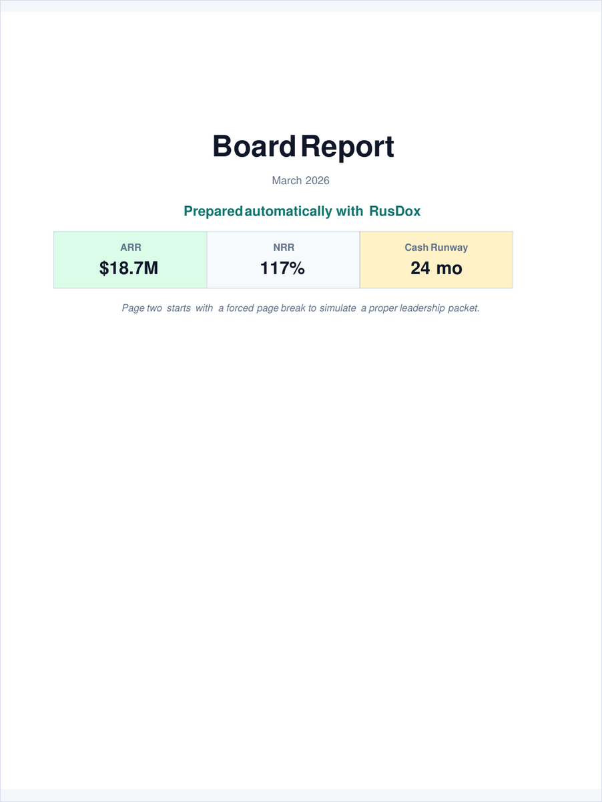
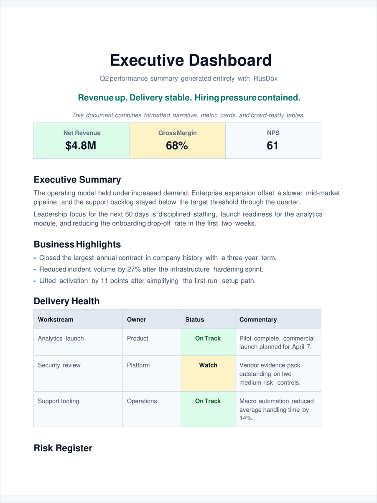
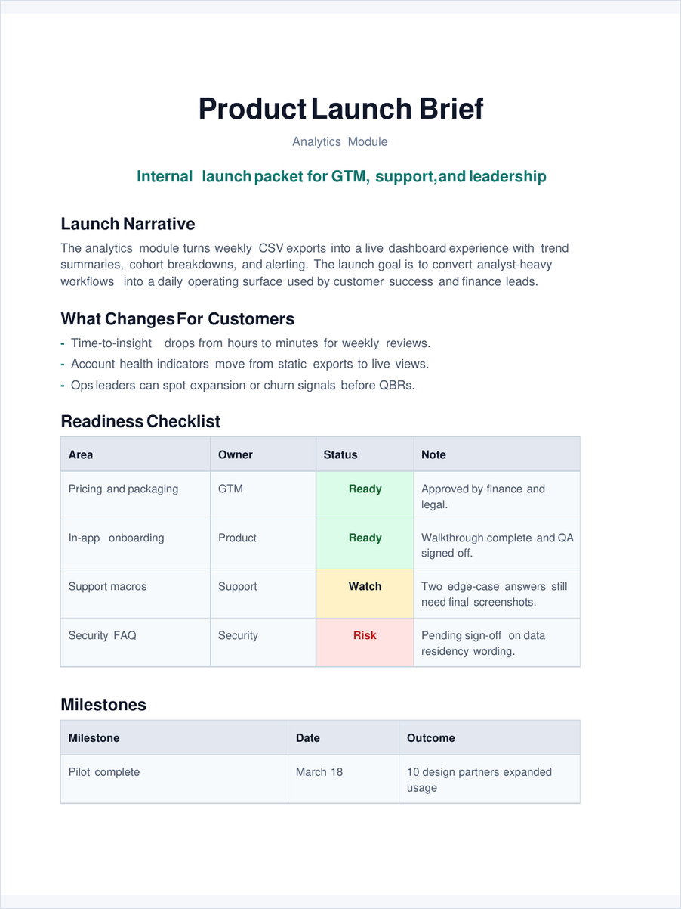
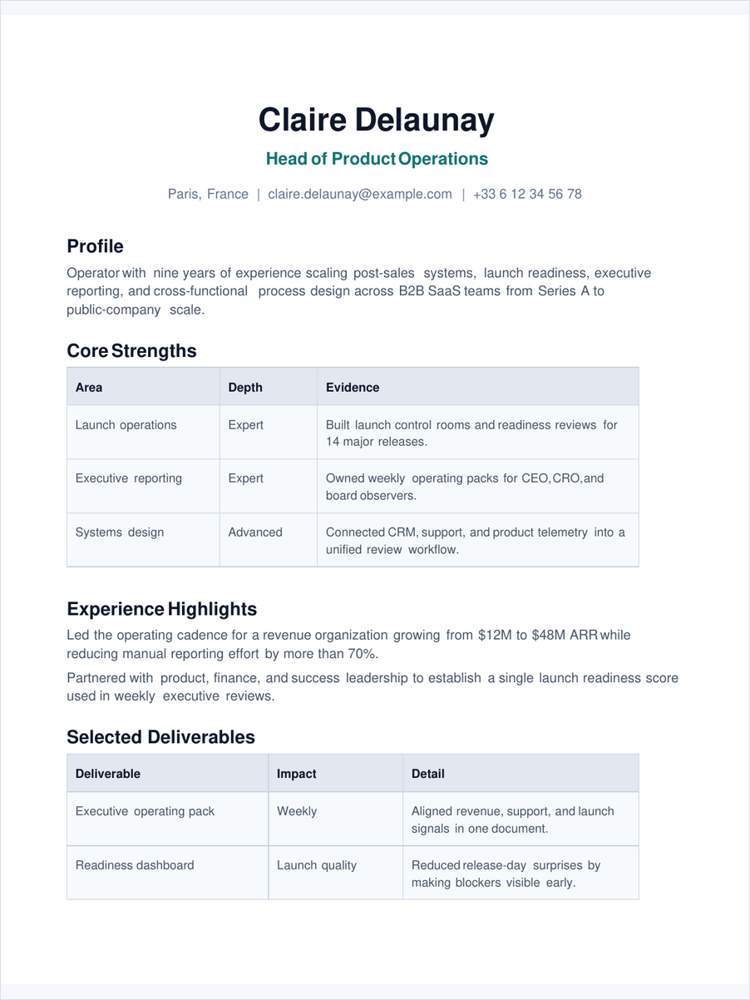
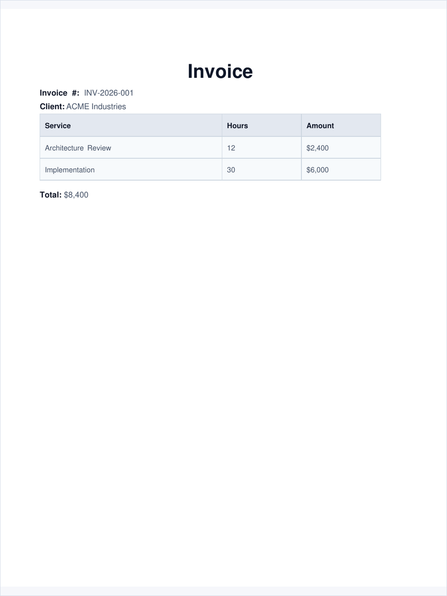
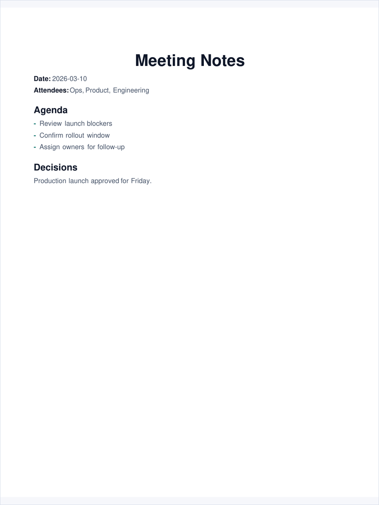

# Template Gallery

These previews are generated from the real PDF outputs in `rendered/`.

That means the gallery shows actual RusDox output, not mockups.

Each featured example also opens in the local-first browser playground. The
playground gives an immediate structural preview; its verified DOCX/PDF links
are enabled only while the checked-in YAML is unchanged.


## Board Report



- Spec: [../examples/board_report.yaml](../examples/board_report.yaml)
- Playground: [Open this example](https://othmaneblial.github.io/rusdox/playground/?example=board-report)
- Evidence: [DOCX/PDF parity report](../parity/board-report-parity.html)
- Output: board-style packet with cover page, metrics, and scorecard tables

## Executive Dashboard



- Spec: [../examples/executive_dashboard.yaml](../examples/executive_dashboard.yaml)
- Playground: [Open this example](https://othmaneblial.github.io/rusdox/playground/?example=executive-dashboard)
- Evidence: [DOCX/PDF parity report](../parity/executive-dashboard-parity.html)
- Output: dashboard-style summary with metrics and status tables

## Product Launch Brief



- Spec: [../examples/product_launch_brief.yaml](../examples/product_launch_brief.yaml)
- Playground: [Open this example](https://othmaneblial.github.io/rusdox/playground/?example=product-launch-brief)
- Evidence: [DOCX/PDF parity report](../parity/product-launch-brief-parity.html)
- Output: launch narrative with milestones and readiness checks

## Talent Profile



- Spec: [../examples/talent_profile.yaml](../examples/talent_profile.yaml)
- Playground: [Open this example](https://othmaneblial.github.io/rusdox/playground/?example=talent-profile)
- Evidence: [DOCX/PDF parity report](../parity/talent-profile-parity.html)
- Output: profile or resume-style document

## Invoice



- Spec: [../examples/invoice.yaml](../examples/invoice.yaml)
- Playground: [Open this example](https://othmaneblial.github.io/rusdox/playground/?example=invoice)
- Evidence: [DOCX/PDF parity report](../parity/invoice-parity.html)
- Output: invoice layout with line items and totals

## Meeting Notes



- Spec: [../examples/meeting_notes.yaml](../examples/meeting_notes.yaml)
- Playground: [Open this example](https://othmaneblial.github.io/rusdox/playground/?example=meeting-notes)
- Evidence: [DOCX/PDF parity report](../parity/meeting-notes-parity.html)
- Output: compact notes with metadata, agenda, and decisions

## Contract Fixtures

These fixtures exercise the less visible parts of the dual-output contract. Their reports are generated from the real DOCX and PDF outputs alongside the visual gallery reports.

### Complete Dual-Output Contract

- Spec: [../examples/dual_output_contract.yaml](../examples/dual_output_contract.yaml)
- Evidence: [DOCX/PDF parity report](../parity/dual-output-contract-parity.html)
- Coverage: shared landscape geometry, visible page fields, breaks, URI and internal links, bookmarks, TOC, footnotes, rich/merged/nested cells, and row pagination controls

### International Scripts

- Spec: [../examples/international_scripts.yaml](../examples/international_scripts.yaml)
- Evidence: [DOCX/PDF parity report](../parity/international-scripts-parity.html)
- Coverage: Unicode preservation and fallback across Latin, Arabic/RTL, Hebrew, CJK, emoji, and mixed-script text; see the compatibility matrix for shaping limits

### Visual Accessibility

- Spec: [../examples/visual_assets_showcase.yaml](../examples/visual_assets_showcase.yaml)
- Evidence: [DOCX/PDF parity report](../parity/visual-assets-showcase-parity.html)
- Coverage: required meaningful alt text preserved across source, reopened DOCX, and PDF semantic projection

## Regenerate Gallery Assets

```bash
./scripts/generate_gallery_assets.sh
./scripts/generate_parity_reports.sh
```
