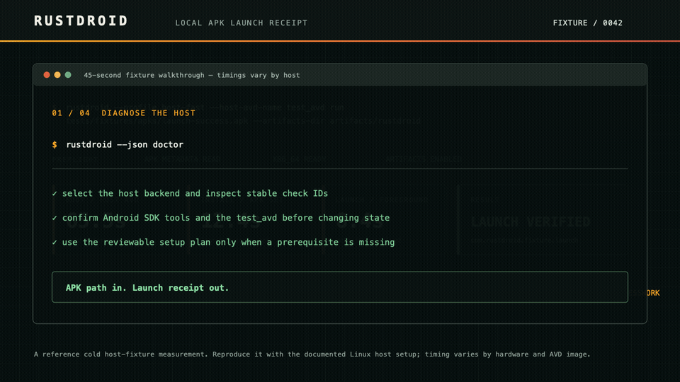

# The RustDroid Demo Receipt

The repository contains a small signed APK fixture so that a new user can see the real APK loop without an Android Studio project or a private app.



The walkthrough is a captioned replay of the exact documented flow. It intentionally shows no universal timing promise; use the receipt and benchmark documentation to compare a supported Linux host.

The visual in [`assets/rustdroid-proof.svg`](../assets/rustdroid-proof.svg) is a reference cold host-fixture run measured on April 2, 2026. Its numbers are context, not a performance promise; reproduce the workflow on your own Linux host and AVD.

## Prerequisites

Use a supported Linux host with KVM, the Android SDK emulator, ADB, an AVD named `test_avd` (or pass your own name), and the RustDroid binary. The [first-install guide](first-install.md) and [support matrix](support-matrix.md) describe the supported path.

## Run the checked-in fixture

```bash
rustdroid \
  --profile host-fast \
  --host-avd-name test_avd \
  run tests/fixtures/apks/launch-success.apk \
  --duration-secs 2 \
  --keep-alive false \
  --artifacts-dir artifacts/rustdroid-demo
```

The run succeeds only after RustDroid has booted or reused the emulator, inspected the APK, installed it, resolved its launch activity, and observed the app in the foreground.

The resulting receipt contains:

- `run-summary.json` for machines and CI;
- `run-report.html` for a quick human review;
- `logcat.txt` and, when available, process/ANR/tombstone evidence.

## Try the same loop with your build

```bash
./gradlew assembleDebug

rustdroid \
  --profile host-fast \
  --host-avd-name test_avd \
  run app/build/outputs/apk/debug/app-debug.apk \
  --duration-secs 2 \
  --keep-alive false \
  --artifacts-dir artifacts/rustdroid
```

For a retained local loop, remove `--keep-alive false` and use `rustdroid watch` against the directory that receives your APK.

## Keep the proof honest

The fixture validates RustDroid's APK path, not the correctness of your app. The timing depends on CPU, KVM availability, emulator image, cold/warm state, and APK ABI. Capture the generated receipt with your bug report or CI artifact rather than copying a benchmark number from this page.
