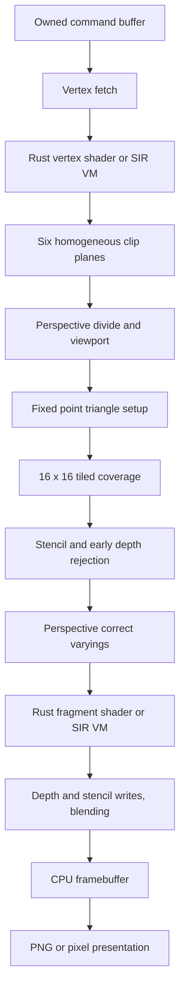

# Architecture

SILICON produces scene pixels in Rust on the CPU. The core library never creates
an OpenGL/Vulkan/Metal device. `png` encodes completed framebuffer bytes; it does
not render. `minifb` is linked only by the CLI and presents the final pixel buffer.
On macOS its implementation uses Metal to copy a framebuffer texture onto a
fixed fullscreen quad. No scene geometry, material, camera, lighting, depth or
SILICON shader reaches that presentation pipeline. Headless mode calls no window
functions and needs no graphics device for rendering.

The workspace groups real responsibilities rather than one crate for each GPU
noun: `silicon-math` holds the math needed by graphics; `silicon-core` implements
resources, command submission and graphics; `silicon-shader` implements the SIR
machine and strict SPIR-V parser/translator; `silicon-cli` is the presentation/headless frontend. The root library
reexports the Rust API and owns examples and integration tests.

Two shader paths exist. Native Rust closures power the lit OBJ showcase. The
`shader_cube` scene submits a recorded command stream and executes *both* stages
through SIR. `spirv_cube` translates externally compiled GLSL vertex/fragment
SPIR-V into SIR. Captures embed lowered programs and support both command scenes.
Native closure scenes cannot be serialized. The [SPIR-V subset](spirv.md) has
explicit type, control-flow, binding and sampling restrictions.

Resources use typed, reference-counted owned buffers. Commands keep their data
alive independently of the creating code. Mapping exposes a read-only slice.
Upload means constructing an owned resource; dynamic subrange updates, device
memory budgets, resource deletion and GPU asynchronous fences are not implemented.
Submission is synchronous. The first command model deliberately permits one
complete render pass; malformed streams are rejected before the framebuffer is
cleared. Per-shader runtime errors include command and instruction context.
