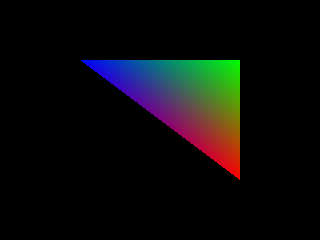

# Adapted third-party demo: Khronos Vulkan hello triangle

Phase 69 runs the triangle scene from KhronosGroup's Vulkan-Samples
`hello_triangle`, pinned to commit
[`177edebf0cd7d4f669667e49f052cfb56b17e004`](https://github.com/KhronosGroup/Vulkan-Samples/commit/177edebf0cd7d4f669667e49f052cfb56b17e004).
Khronos describes it as a self-contained Vulkan 1.1 triangle sample in the
[API sample index](https://github.com/KhronosGroup/Vulkan-Samples/blob/177edebf0cd7d4f669667e49f052cfb56b17e004/samples/api/README.adoc).
The upstream [host source](https://github.com/KhronosGroup/Vulkan-Samples/blob/177edebf0cd7d4f669667e49f052cfb56b17e004/samples/api/hello_triangle/hello_triangle.cpp)
defines three colored vertices and submits `vkCmdDraw(3, 1, 0, 0)`. Its
[vertex shader](https://github.com/KhronosGroup/Vulkan-Samples/blob/177edebf0cd7d4f669667e49f052cfb56b17e004/shaders/hello_triangle/glsl/triangle.vert)
transforms positions and passes per-vertex RGB; its
[fragment shader](https://github.com/KhronosGroup/Vulkan-Samples/blob/177edebf0cd7d4f669667e49f052cfb56b17e004/shaders/hello_triangle/glsl/triangle.frag)
outputs the interpolated color with alpha 1.

`examples/khronos_hello_triangle.rs` preserves the upstream positions, RGB
values, interpolation, and non-indexed three-vertex draw. It adapts the vertex
color input from `vec3` to `vec4` and pads each vertex with alpha 1 to satisfy
SILICON's fixed vertex layout; the adapted vertex shader forwards `.rgb` to the
original `vec3` varying. It also explicitly limits `gl_PerVertex` to
`gl_Position`, as required by SILICON's documented SPIR-V subset. The upstream
fragment shader is unchanged. The Rust host records a clear pass, pipeline,
vertex buffer and draw through `silicon::vulkan_like`, then writes SILICON's
CPU framebuffer; it does not run the upstream Vulkan host application or load
the Vulkan ABI.

The upstream repository and shaders are Apache-2.0; shader copyright and
license notices remain in the source files. See the pinned upstream
[license](https://github.com/KhronosGroup/Vulkan-Samples/blob/177edebf0cd7d4f669667e49f052cfb56b17e004/LICENSE).

The bundled SPIR-V fixtures were built with glslang 16.6.0 and validated with
SPIRV-Tools 2026.3:

```sh
glslangValidator -V --target-env vulkan1.0 -o assets/shaders/khronos_hello_triangle.vert.spv assets/shaders/khronos_hello_triangle.vert
glslangValidator -V --target-env vulkan1.0 -o assets/shaders/khronos_hello_triangle.frag.spv assets/shaders/khronos_hello_triangle.frag
spirv-val --target-env vulkan1.0 assets/shaders/khronos_hello_triangle.vert.spv
spirv-val --target-env vulkan1.0 assets/shaders/khronos_hello_triangle.frag.spv
cargo run --release --example khronos_hello_triangle
```

The runnable sample writes `output/khronos_hello_triangle.png`. Its
integration test checks that SILICON executes the external shaders and
produces many interpolated colors. This demonstrates one adapted sample inside
SILICON's documented subset, not general Vulkan or SPIR-V compatibility.


