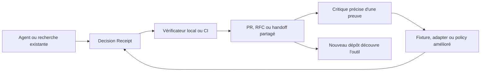

# Roadmap d'adoption — Web Task Agent

> Roadmap post-`v0.5.1`, actualisée le 27 août 2026. Les phases sont ordonnées par dépendance, pas par dates artificielles.

## Le diagnostic en une phrase

Le produit est déjà techniquement sérieux ; ce qui lui manque n'est pas une nouvelle pile de fonctionnalités, mais une **porte d'entrée minuscule, interopérable et visible dans les outils que les développeurs utilisent déjà**.

La viralité ne se programme pas et aucune roadmap ne peut promettre des étoiles. En revanche, le projet peut créer une boucle crédible où chaque usage produit un artefact utile, partageable et vérifiable qui expose naturellement le dépôt à d'autres personnes.

## État réel au 27 août 2026

### Ce qui est déjà livré

- ✅ CLI TypeScript local-first avec état durable, file de jobs, reprise, Chrome/Lightpanda, politiques de sources, redaction et exports.
- ✅ `Decision Receipt v1` avec claims, preuves, contradictions, limites, snapshots, fraîcheur et prochaine validation.
- ✅ `receipt verify`, `receipt compare`, `receipt import` et signature Ed25519 optionnelle.
- ✅ Huit receipts déterministes, trois golden paths, scorecard et fixtures adversariales.
- ✅ Trust model, guides de contribution, templates d'issues, Discussions et site GitHub Pages.
- ✅ Release `v0.5.1` avec tarball, checksum et provenance ; CI actuelle verte.
- ✅ Vérification locale de cette roadmap : **162 tests unitaires, 4 intégrations, 0 échec**, artefacts générés synchronisés et 420 liens Markdown locaux validés.

### Ce que les signaux publics disent vraiment

| Signal public | Baseline | Lecture honnête |
| --- | ---: | --- |
| Étoiles / forks / watchers | 0 / 0 / 0 | Le dépôt n'a pas encore de portée externe mesurable. |
| Issues ouvertes | 6 | Elles ont toutes été amorcées par le mainteneur ; trois nouvelles issues ouvrent adapter, revue sécurité et validation externe sans compter comme adoption. |
| Discussions | 5 | Elles ont toutes été amorcées par le mainteneur, sans réponse choisie. |
| Téléchargements des deux assets `v0.5.1` | 1 chacun | Cela prouve la vérification de release, pas l'adoption. |
| Package public npm | absent | Le chemin sans authentification reste le tarball GitHub. |
| Interopérabilité authentique | 2 moteurs | Browser Use et GPT Researcher sont réels mais volontairement bornés ; ils prouvent l'import, pas la vérité ni une compatibilité générale. |

Le goulot n'est donc plus la crédibilité technique. Il est situé entre **voir**, **essayer**, **intégrer**, **réutiliser** et **recommander**.

### Les écarts qui comptent maintenant

1. L'ancienne roadmap décrivait comme futures des fonctions déjà livrées en `v0.5.1`.
2. `LAUNCH.md` parle encore de `v0.4.0`.
3. Le site est visuellement fort, mais son bloc « Quick Start » commence par `npm ci` et `npm run start` : c'est un parcours contributeur depuis les sources, pas un essai public immédiat.
4. Le receipt est agréable à lire, mais le visiteur ne peut pas déposer le sien pour le vérifier ou le comparer localement.
5. Le contrat est enfermé dans le CLI : pas de JSON Schema autonome, pas de package SDK léger, pas de matrice de compatibilité.
6. `package.json` pointe `main` vers le CLI, sans `exports` ni `types` publics ; réutiliser le vérificateur importe inutilement la surface complète du runner et du fournisseur LLM.
7. Il n'existe ni GitHub Action, ni MCP local, ni intégration qui place le produit dans un workflow déjà fréquenté.
8. Le projet a beaucoup de preuves générées par son mainteneur, mais aucune preuve d'utilité répétée par un tiers.

---

## La nouvelle décision produit

### Catégorie à éviter

Ne pas affronter Browser Use sur le contrôle du navigateur, Stagehand sur le SDK d'automatisation, ou GPT Researcher sur la génération de rapports. Ces catégories sont déjà occupées par des projets très visibles, distribués dans plusieurs langages et intégrés à de nombreux outils.

### Catégorie à créer

> **The verification layer for AI research. Turn any agent run into a Decision Receipt you can verify, diff, and review offline.**

En français : **la couche de vérification des recherches produites par des agents**.

L'agent de recherche actuel reste un producteur de référence. Le produit d'entrée devient le protocole `Decision Receipt` et ses outils de vérification. Browser Use, Stagehand, GPT Researcher ou un script interne peuvent produire les données ; Web Task Agent les transforme en preuve portable et contestable.

### Premier public à servir

Le beachhead n'est pas « toutes les équipes qui font de la recherche ». Ce sont :

- les mainteneurs et développeurs qui utilisent un agent pour justifier une décision dans une PR, un RFC ou un ADR ;
- les builders d'agents qui veulent rendre leurs résultats auditables sans reconstruire un système de provenance ;
- les équipes local-first qui refusent d'envoyer leurs rapports vers un SaaS de vérification.

### Moment signature

Un reviewer ouvre une PR et voit :

```text
Decision Receipt: verified
12 claims · 9 supported · 2 contradicted · 1 insufficient
3 sources changed · 1 source stale · decision changed
```

Il peut ensuite ouvrir le diff ou le receipt, remonter de chaque claim à son extrait, et vérifier l'intégrité hors ligne.

## La boucle de croissance à construire



Cette boucle est défendable parce que chaque nouveau receipt peut améliorer le protocole, les fixtures et les adapters. Une simple galerie de prompts ou un catalogue de workflows n'a pas ce même effet cumulatif.

---

## P0 — Aligner immédiatement la promesse et la réalité

**But :** qu'un visiteur comprenne en quinze secondes ce qui est unique, puis touche une preuve sans cloner le dépôt.

- [x] Marquer clairement l'ancienne roadmap P0–P4 comme livrée par `v0.5.1` dans le changelog et les notes de release.
- [x] Mettre `LAUNCH.md`, README, site, exemples et liens de release sur la même version et le même message.
- [x] Remplacer le « Quick Start » du hero par un chemin public. Tant que npm n'est pas publié, utiliser le tarball signé/checksummé ; après P3, basculer sur une commande `npx`.
- [x] Faire du CTA principal **Inspect a verified receipt** ; après P2, le remplacer par **Verify your receipt locally**. Conserver « Run live research » comme parcours secondaire.
- [x] Ajouter une animation courte et accessible : import → vérification → claim contredit → diff. Fournir une image statique et un transcript, sans autoplay agressif.
- [x] Montrer au-dessus de la ligne de flottaison les trois états qui différencient le produit : `verified`, `contradicted`, `changed`.
- [x] Remplacer les métriques de volume en hero (`243 workflows`) par une preuve de résultat. Le catalogue reste dans la documentation.

**Preuve d'acceptation :** cinq personnes qui ne connaissent pas le dépôt peuvent répondre, sans aide, à « qu'est-ce que c'est ? », « pourquoi pas un autre browser agent ? » et « où est la preuve ? ». Le premier écran propose une action qui ne demande ni clone, ni clé, ni compte.

**État :** implémentation technique et QA desktop/mobile terminées ; les cinq tests de compréhension externes restent un gate humain suivi en P5.

---

## P1 — Sortir `Decision Receipt` du monolithe

**Dépendance :** P0, car un protocole sans promesse nette devient seulement un nouveau format JSON.

### 1. Publier un contrat réellement indépendant

- [x] Ajouter `schema/decision-receipt.v1.schema.json` en JSON Schema Draft 2020-12.
- [x] Documenter champs obligatoires, enums, limites, canonicalisation, hash, signature, chemins sûrs et comportement pour champs inconnus.
- [x] Définir la compatibilité : patch rétrocompatible, minor additif, major avec migration explicite.
- [x] Ajouter `schemaVersion`, `specVersion` et un identifiant de profil séparés de la version du CLI.
- [x] Fournir des exemples minimaux, complets, contradictoires, incomplets, périmés, signés et falsifiés.

### 2. Créer un noyau réutilisable

Nom de package proposé : `@othmaneblial/decision-receipt`, à confirmer au moment de la publication.

- [x] Extraire validation, vérification, comparaison, rendu et types dans un package sans navigateur, LLM, SQLite ou réseau.
- [x] Publier `exports`, types TypeScript, ESM et CommonJS si la matrice de support le justifie.
- [x] Garder le cœur déterministe : aucun accès réseau implicite, aucune télémétrie, aucun code fournisseur.
- [x] Rendre le CLI principal consommateur de cette API au lieu de maintenir deux implémentations.
- [x] Fixer un budget de poids et auditer l'arbre de dépendances du package public.

### 3. Ouvrir un kit de conformité

- [x] Créer un runner de conformance utilisable depuis TypeScript et en ligne de commande.
- [x] Versionner des cas `valid`, `invalid`, `tampered`, `unsafe-path`, `unknown-version` et `signature-mismatch`.
- [x] Tester les migrations N-1 → N et garantir qu'une version inconnue échoue explicitement.
- [x] Publier une matrice : spec, CLI, SDK, Action, web verifier et adapters compatibles.

**Preuve d'acceptation :** un projet TypeScript vierge installe uniquement le noyau, valide une fixture et rend un diff sans importer Anthropic, Chrome, la base de données ou le runner. Une seconde implémentation peut passer le corpus à partir du JSON Schema sans lire le code du CLI.

**État :** livré et vérifié localement. Le test du tarball installe le noyau sans dépendance dans un projet TypeScript vierge, compile puis rend un diff ; le paquet reste sous le budget de 180 Ko décompressé. Le corpus passe via le runner exporté et, séparément, via Ajv sur le JSON Schema sans importer le noyau ni le CLI. La publication npm reste volontairement une porte externe de P3.

---

## P2 — Construire la démo qui mérite d'être partagée

**Dépendance :** P1. Le navigateur doit exécuter le même contrat que le CLI.

### Vérificateur web 100 % local

- [x] Ajouter au site une zone de dépôt pour un dossier ou une archive de receipt.
- [x] Lire les fichiers avec les API du navigateur ; aucun upload, backend, cookie, compte ou analytics nécessaire.
- [x] Afficher l'état d'intégrité, la version du schéma, les claims soutenus/contradictoires/insuffisants, les sources périmées et les limites.
- [x] Permettre la navigation claim → extrait → snapshot → hash.
- [x] Comparer deux receipts et expliquer séparément les changements de sources, politique, modèle, synthèse et décision.
- [x] Générer un `verification-report.json` local partageable, sans inclure les sources privées par défaut.
- [x] Proposer trois fixtures sûres : valide, falsifiée, décision modifiée.
- [x] Concevoir le résultat pour clavier, lecteur d'écran, mobile, contraste élevé et `prefers-reduced-motion`.

### Garde-fou de vérité

Le badge doit dire **integrity verified**, jamais **decision is true**. Un hash prouve l'intégrité d'octets ; une signature prouve le contrôle d'une clé ; ni l'un ni l'autre ne prouve qu'une source est vraie, complète, autorisée ou fraîche.

**Preuve d'acceptation :** avec le réseau bloqué après chargement, le site valide une archive correcte, identifie le fichier exact d'une archive falsifiée et compare deux décisions. Aucun contenu du receipt n'apparaît dans une requête réseau, un log distant ou un stockage persistant sans consentement.

**État :** livré et vérifié dans Chrome sur desktop et mobile. Après arrêt complet du serveur local, les fixtures préchargées continuent de valider puis de nommer `evidence/source.md` comme fichier falsifié. Le diff sépare les cinq signaux attendus. Aucun appel réseau, stockage persistant ou erreur console n'est présent ; le DOM n'a ni identifiant dupliqué ni input sans label, et le viewport mobile ne déborde pas.

---

## P3 — Mettre le receipt dans le chemin naturel des développeurs

**Dépendance :** P1 et P2.

### 1. Distribution npm publique et sans token utilisateur

- [ ] Publier le noyau et le CLI sur le registre npm public depuis un tag protégé.
- [ ] Utiliser npm Trusted Publishing/OIDC et la provenance automatique ; ne pas conserver de token npm longue durée en CI.
- [ ] Faire fonctionner un premier succès du type `npx … verify fixture/` sans clé, navigateur ou configuration.
- [x] Tester l'installation dans un répertoire neuf sur la matrice Node LTS officiellement supportée.
- [x] Conserver le tarball GitHub, SHA-256 et attestation comme chemin de vérification indépendant.

**Porte externe :** la réservation du nom, la configuration du trusted publisher et la première publication exigent l'autorisation du propriétaire npm. Une CI verte ne permet pas de déclarer ce point livré.

**État intermédiaire :** le noyau expose maintenant le binaire sans clé `decision-receipt`, les tarballs CLI/noyau sont installés puis exécutés en répertoires vierges sur Node 20/22/24, et `publish-npm.yml` demande uniquement OIDC avec provenance automatique. Les noms sont libres au moment du contrôle, mais la session locale n'est pas authentifiée à npm : réservation, trusted publisher, première publication, provenance publique et `npx` depuis le registre restent donc ouverts.

### 2. GitHub Action dédiée

Créer un dépôt étroit `OthmaneBlial/decision-receipt-action`, car GitHub Marketplace attend une Action clairement empaquetée autour d'un `action.yml` racine.

- [x] Entrées : glob de receipts, version de spec acceptée, seuil de fraîcheur et politique de claims insuffisants.
- [x] Sorties : statut, compteurs, chemin du rapport, résumé Markdown et diff éventuel.
- [x] Ajouter des annotations de fichiers et un Step Summary lisible ; le mode par défaut reste `contents: read` sans commentaire ni écriture.
- [x] Rendre le commentaire de PR optionnel et documenter la permission explicite requise.
- [x] Publier des tags majeurs immuables/maintenus, notes de release, checksums et tests contre des PRs de fixtures.
- [x] Proposer une intégration de trois lignes :

```yaml
- uses: OthmaneBlial/decision-receipt-action@v1
  with:
    path: decisions/**/*.receipt.json
```

**Preuve d'acceptation :** deux dépôts publics distincts montrent une PR verte et une PR rouge reproductibles. La PR rouge nomme le claim, la source ou le hash fautif. L'Action ne reçoit aucun secret et ne fait aucun appel réseau hors téléchargement normal de l'Action.

**État :** livré dans [`OthmaneBlial/decision-receipt-action`](https://github.com/OthmaneBlial/decision-receipt-action) et publié en `v1.0.0` avec tag immuable, tag majeur maintenu, release illustrée et checksums revérifiés. La [PR verte du dépôt principal](https://github.com/OthmaneBlial/web-task-agent/pull/9) et la [PR rouge du dépôt de démonstration](https://github.com/OthmaneBlial/decision-receipt-demo/pull/1) exécutent toutes deux `@v1` sans secret. La rouge expose trois annotations sur `evidence/source.md` : octets, SHA-256 du manifeste et hash du snapshot. Un test exécute le chemin par défaut avec les primitives réseau bloquées ; le commentaire reste un opt-in séparé.

### 3. Faire de chaque intégration une surface de découverte

- [x] Badge `Decision Receipt verified` lié au rapport ou à la documentation du protocole.
- [x] Template de PR/RFC qui demande : décision, contradiction principale, invalidation et prochaine validation.
- [x] Exemple complet dans un petit dépôt de démonstration, pas seulement dans le monorepo.
- [x] Release notes illustrées avec un receipt et son diff, jamais une liste abstraite de commits.

---

## P4 — Devenir la couche d'interopérabilité des agents existants

**Dépendance :** P1–P3. L'interop n'est utile que si le format et sa distribution sont stables.

### 1. Contrat d'adapter

- [x] Définir une entrée fournisseur-neutre minimale : claims, sources, extraits, limites, date, modèle/policy connus et prochaine validation.
- [x] Séparer strictement `imported`, `captured`, `inferred` et `operator-attested`.
- [x] Refuser cookies, sessions, prompts fournisseurs, URLs avec identifiants et instructions exécutables.
- [x] Fournir un générateur d'adapter et des tests contractuels.

**État :** contrat `1.0.0` livré avec validation runtime et JSON Schema indépendant. Le générateur produit un adapter exécutable, une fixture explicitement synthétique et une recette de revue ; ses sorties passent le même validateur que l'importeur. Les champs inconnus et les données privées fournisseur échouent fermés, et toute inférence ou attestation opérateur exige une note.

### 2. Prouver deux imports authentiques

- [x] Choisir le premier adapter à partir d'une demande réelle, pas du prestige du fournisseur.
- [x] Importer un run authentique de deux moteurs parmi Browser Use, Stagehand et GPT Researcher.
- [x] Publier les commandes, versions, données redistribuables, limites et receipts résultants.
- [x] Ajouter ces runs à la matrice de compatibilité sans promettre que les sources tierces sont vraies.

**État — 2/2 :** la demande d'implémentation P4 et la contrainte réelle de disque de l'opérateur ont déterminé les adapters. Browser Use `0.13.8` a capturé une page publique avec Chrome ; GPT Researcher `0.16.0` a synthétisé un extrait public préchargé. Les deux runs réutilisent le seul modèle Ollama ultra-light de 523 Mo, n'ouvrent aucune session authentifiée et publient sortie moteur privacy-safe, commande, version, limites, adapter et receipt vérifié. Le second run évite volontairement la retrieval pour ne pas télécharger un modèle d'embedding ; il prouve l'import de la sortie du moteur, pas sa recherche web. La trace de raisonnement émise malgré `/no_think` est supprimée de la projection, dont seul le hash brut est conservé.

### 3. Exposer les opérations via MCP local

- [x] Serveur STDIO local limité à `verify_receipt`, `compare_receipts`, `import_result` et `render_receipt`.
- [x] Aucun outil de navigation, shell, cookie, authentification ou écriture externe.
- [ ] Publier le package npm avant les métadonnées du registre MCP officiel.
- [x] Ajouter une Skill/recette d'installation qui apprend aux agents à produire ou vérifier un receipt sans contourner le consentement utilisateur.

**État intermédiaire :** le serveur négocie MCP `2025-11-25`, borne requêtes et réponses à 2 Mo, confine tous les chemins à `DECISION_RECEIPT_ROOT` et refuse les liens symboliques. Un test avec primitives réseau bloquées couvre les quatre outils ; un second test passe par le client TypeScript MCP officiel pour le handshake, la découverte et la vérification. La publication npm et les métadonnées du registre restent liées à la porte propriétaire de P3.

**Preuve d'acceptation :** deux sorties authentiques de moteurs externes passent le corpus de conformité et conservent leurs limites. Un client MCP peut vérifier et comparer hors ligne ; aucune session fournisseur ni donnée privée n'entre dans le package.

**Acceptation observée :** les receipts Browser Use et GPT Researcher passent le même validateur runtime, le JSON Schema indépendant et la vérification d'intégrité. Le client MCP officiel négocie et vérifie hors ligne. L'enregistrement au registre MCP reste bloqué, comme la publication npm dont il dépend ; ce canal de distribution n'est pas présenté comme livré.

---

## P5 — Produire la preuve externe qui manque au dépôt

**Dépendance :** au minimum P2 et P3.

### Études de cas réellement falsifiables

- [ ] Recruter trois utilisateurs externes correspondant au beachhead.
- [ ] Publier, avec accord, un cas PR/RFC, un changement de décision et un import depuis un agent tiers.
- [ ] Pour chaque cas : question, entrée, policy, receipt, contradiction, décision, invalidation, temps de revue et retour critique.
- [ ] Ne pas sélectionner uniquement les succès ; publier au moins un cas où le receipt reste `insufficient` ou ne change pas la décision.

**Recrutement ouvert, baseline inchangée :** [l'issue #12](https://github.com/OthmaneBlial/web-task-agent/issues/12) invite trois tracks consentis et accepte explicitement résultats négatifs, neutres, abandonnés, `insufficient` ou sans changement. Elle ne constitue ni un participant ni un usage ; les quatre cases restent ouvertes jusqu'à des cas externes réels.

### Test de valeur reviewer

Comparer un rapport Markdown seul avec le même rapport accompagné d'un receipt. Mesurer :

- temps pour retrouver la preuve d'un claim ;
- détection d'une contradiction ;
- détection d'une source périmée ;
- détection d'une falsification ;
- confiance déclarée, séparée de la justesse réelle.

Publier protocole, petits dénominateurs, données anonymisées consenties et limites. Ne revendiquer un gain que si le résultat le montre.

- [x] Figer avant recrutement deux cas synthétiques parallèles, l'assignation contrebalancée `AB`/`BA` et quatre réponses scorables.
- [x] Livrer les receipts valides et falsifiés, le schéma de réponse strict, la validation locale et l'agrégateur descriptif sans télémétrie.
- [x] Ouvrir un parcours web local-only avec chrono par trial, ZIPs bornés et export JSON anonyme, sans endpoint de soumission ni persistance.
- [ ] Inclure au moins cinq reviewers externes consentants et publier les dénominateurs, abandons, limites et lignes autorisées.

**Kit livré, résultat externe non inventé :** [`studies/reviewer-value/`](studies/reviewer-value/) contient deux rapports Markdown, deux receipts vérifiables et deux falsifications contrôlées. Le [Reviewer Evidence Lab](https://othmaneblial.github.io/web-task-agent/study.html) applique le même ordre `AB`/`BA`, lance le chrono au reveal, télécharge les ZIPs et exporte la réponse localement. Les falsifications échouent exactement sur `evidence/cache-policy.md` et `evidence/update-policy.md`. Le validateur refuse la dérive d'assignation et les champs d'identité/secret ; l'agrégateur exclut les fixtures et l'absence de consentement, sépare temps, justesse, confiance et abandons, et ne produit aucun test de significativité ni claim de supériorité. La seule réponse versionnée est synthétique : baseline réelle **0 participant**, donc la case externe reste ouverte.

### Revue de sécurité indépendante

- [x] Demander une revue externe du schéma, de la canonicalisation, des chemins d'archive, des signatures, du rendu HTML et de la frontière local-only.
- [ ] Convertir chaque faille en test de non-régression et advisory si nécessaire.
- [x] Publier ce qui a été testé et ce qui ne l'a pas été.

**Préparation livrée, adoption non simulée :** `EXTERNAL_VALIDATION.md` fixe trois tracks, le protocole reviewer, le consentement granulaire et une baseline externe à zéro ; le kit exécutable en matérialise maintenant le test avant recrutement. `SECURITY_REVIEW.md` publie le commit pinning, les six surfaces prioritaires, les commandes, les preuves mainteneur et les zones non auditées. La [demande publique de revue #10](https://github.com/OthmaneBlial/web-task-agent/issues/10) borne le résultat attendu et redirige toute faille vers une advisory privée. Aucun participant, audit reçu ni reviewer indépendant n'est compté avant une trace réelle.

**Preuve d'acceptation :** au moins cinq receipts ont été vérifiés par des non-mainteneurs, trois utilisateurs ont produit un second receipt ou un diff, et une revue indépendante a laissé une trace publique exploitable.

---

## P6 — Lancer une communauté autour des preuves

**Dépendance :** ne pas lancer largement avant d'avoir le vérificateur web, le package public et au moins une intégration reproductible.

### Un lancement = un artefact

1. **Protocol launch** — JSON Schema, conformance kit et receipt falsifié à détecter.
2. **Verifier launch** — démo locale drag-and-drop, sans upload.
3. **GitHub Action launch** — PR réelle avec diff de décision.
4. **Interop launch** — un run Browser Use/Stagehand/GPT Researcher transformé et vérifié.
5. **Evidence study** — résultats du test reviewer, y compris limites et échecs.

Chaque publication doit pointer directement vers l'artefact essayable, pas seulement vers la homepage.

### Canaux pertinents, sans spam

- Show HN lorsque la démo tient en moins d'une minute.
- Communautés local-first, agent builders, GitHub Actions, MCP et AI safety/provenance.
- Articles techniques : canonicalisation et tamper detection, decision diff, sécurité d'import de résultats d'agents.
- PRs vers des listes `awesome-*` uniquement quand le projet satisfait réellement leurs critères.
- Topics GitHub (`provenance`, `json-schema`, `github-actions`, `mcp`, `ai-safety`) seulement après livraison des surfaces correspondantes.

### Contributions qui renforcent le moat

- [x] `good first adapter` avec fixture et contrat.
- [x] `good first policy case` avec charge adversariale.
- [x] `receipt review` avec preuve de reproduction.
- [x] RFC obligatoire pour toute rupture de schéma.
- [x] `MAINTAINERS.md`, politique de compatibilité et règles de release v1.
- [x] Galerie opt-in de receipts publics, licenciés et expurgés ; aucune collecte automatique.

**État :** les contrats existent comme issue forms testées et comme issues publiques : [adapter #11](https://github.com/OthmaneBlial/web-task-agent/issues/11), [policy case #3](https://github.com/OthmaneBlial/web-task-agent/issues/3) et [receipt review #2](https://github.com/OthmaneBlial/web-task-agent/issues/2). Le RFC définit les surfaces byte-level et la migration obligatoires ; la gouvernance nomme honnêtement un seul mainteneur ; la galerie exige licence, consentement et redaction, ne collecte rien et reste vide jusqu'à une vraie soumission. Les topics `decision-receipt`, `provenance`, `json-schema`, `github-actions`, `mcp` et `ai-safety` ne sont ajoutés qu'après livraison des surfaces correspondantes. Une issue ouverte n'est pas une contribution externe fusionnée.

**Preuve d'acceptation :** deux PRs externes fusionnées, trois dépôts publics utilisant l'Action et au moins un cas communautaire devenu fixture, adapter ou décision de spec. Les posts manuels, partenariats et retours humains restent des tâches externes ; ils ne peuvent pas être simulés par le code.

---

## Gate `v1.0`

Ne pas publier `v1.0` parce que la liste de features est longue. La publier seulement quand ces contrats sont vrais :

- [x] Schéma v1 public, versionné, documenté et couvert par un corpus de conformité.
- [x] CLI, SDK, web verifier et Action utilisent le même noyau.
- [ ] Installation npm publique, provenance, tarball et checksum vérifiés depuis des environnements propres.
- [x] Compatibilité N-1 testée et migration documentée.
- [ ] Deux imports tiers authentiques et trois usages répétés externes.
- [ ] Menaces liées aux archives, HTML, URL, secrets, signature et canonicalisation revues.
- [x] Accessibilité, mobile, no-network et no-telemetry vérifiés sur le web verifier.
- [x] Aucun claim marketing important sans source, dénominateur et limite.

**Lecture du gate :** cinq contrats techniques v1 sont démontrés par le corpus, la migration, les builds partagés, la QA du verifier et les tests de positionnement. Ils n'autorisent pas une release v1 : npm public, trois usages externes répétés et la revue de menaces indépendante restent bloquants.

## Métriques de décision

La north star n'est pas « étoiles acquises ». C'est :

> **Nombre de receipts externes vérifiés ou comparés une seconde fois.**

Sans télémétrie cachée, utiliser uniquement des liens publics, retours consentis et agrégats de registre/GitHub.

| Étape | Signal | Gate avant d'élargir |
| --- | --- | --- |
| Compréhension | Personne explique la différence en une phrase | 5/5 tests de message réussis |
| Activation | Installation propre ou vérification web terminée | 10 réussites externes documentées |
| Valeur | Receipt vérifié par une autre personne | 5 receipts externes |
| Rétention | Second receipt ou premier diff | 3 utilisateurs répétés |
| Intégration | Action active dans un dépôt tiers | 3 dépôts publics |
| Interop | Run tiers authentique conforme | 2 moteurs externes |
| Communauté | PR externe fusionnée | 2 contributions utiles |
| Portée | Visiteurs, clones, forks, étoiles, citations | Suivis après les signaux précédents, jamais seuls |

## Ce qu'il ne faut pas construire maintenant

- Un nouveau moteur navigateur ou un clone de Browser Use/Stagehand.
- Plus de workflows avant qu'un utilisateur externe ne demande un cas précis.
- Un SaaS multi-tenant, une base de receipts hébergée ou de la télémétrie silencieuse.
- Une marketplace ouverte de prompts/adapters sans conformance et revue de sécurité.
- Une extension VS Code, app mobile ou dashboard d'équipe avant l'adoption de l'Action.
- Des intégrations avec dix fournisseurs basées sur des fixtures inventées.
- Des benchmarks « accuracy » qui comparent des modèles sans oracle publiable.
- Des badges « verified truth », « unbiased » ou « hallucination-free ».

## Risques et décisions de repli

| Risque | Signal d'alerte | Décision |
| --- | --- | --- |
| Le receipt paraît trop lourd | Les utilisateurs préfèrent joindre un simple rapport | Proposer un profil minimal de 5–7 champs, sans affaiblir les labels de vérité. |
| Le runner masque le protocole | Les visiteurs parlent uniquement de scraping/browser agent | Séparer encore plus SDK, Action et site du moteur de recherche de référence. |
| L'Action ne crée pas de valeur répétée | Elle n'est installée que dans le dépôt de démo | Arrêter Marketplace et concentrer le produit sur web verifier + SDK. |
| Les adapters perdent la provenance | Les imports remplissent les trous par inférence | Marquer `insufficient`, refuser l'import ou demander une attestation opérateur explicite. |
| La promotion apporte des étoiles sans usage | Aucun receipt, diff ou contribution ne suit | Suspendre la promotion et corriger activation/message. |

## Ordre d'exécution

1. P0 — cohérence du message et parcours public.
2. P1 — schéma, noyau et conformance.
3. P2 — vérificateur web local.
4. P3 — npm public et GitHub Action.
5. P4 — deux imports authentiques puis MCP local.
6. P5 — utilisateurs externes, test reviewer et revue sécurité.
7. P6 — lancements par artefact et boucle de contribution.
8. `v1.0` uniquement après les gates d'usage répété.

Ne pas inverser P1–P3 : envoyer du trafic vers un protocole non réutilisable ou une installation exigeant un token reproduirait exactement le goulot actuel.

## Références de recherche

- [Browser Use](https://github.com/browser-use/browser-use), [Stagehand](https://github.com/browserbase/stagehand) et [GPT Researcher](https://github.com/assafelovic/gpt-researcher) : contrôle navigateur, packages, rapports, intégrations et quickstarts sont déjà des attentes de catégorie.
- [npm Trusted Publishing](https://docs.npmjs.com/trusted-publishers/) : publication OIDC sans token longue durée et provenance automatique pour les packages publics éligibles.
- [Publishing actions in GitHub Marketplace](https://docs.github.com/en/actions/how-tos/create-and-publish-actions/publish-in-github-marketplace) : contraintes de packaging et publication d'une Action publique.
- [Official MCP Registry quickstart](https://modelcontextprotocol.io/registry/quickstart) : registre de métadonnées, package sous-jacent requis et statut preview.
- [JSON Schema Draft 2020-12](https://json-schema.org/draft/2020-12) : base language-neutral du contrat de receipt.
- [NIST AI RMF](https://airc.nist.gov/airmf-resources/airmf/5-sec-core/) et [OWASP LLM Prompt Injection](https://genai.owasp.org/llmrisk/llm01-prompt-injection/) : limites, provenance, gouvernance des risques et cas adversariaux.
